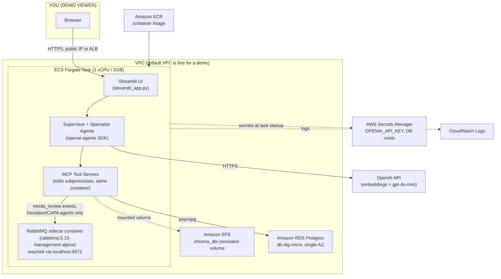

# Deploying the CMC Quality Copilot to AWS — Step-by-Step

**App:** `copilot-demo/` (Streamlit UI + `openai-agents` supervisor/specialist agents + stdio MCP tool servers + ChromaDB + Postgres)
**Goal:** A real, reachable AWS deployment of this demo, budgeted to run continuously for **~$15–30/month**.
**Companion doc:** [NRG_Energy_Architecture_Deep_Dive.md](NRG_Energy_Architecture_Deep_Dive.md) — that doc describes a *target-state enterprise architecture* (OpenSearch Serverless, Bedrock Knowledge Bases, Amazon MQ, Multi-AZ RDS, etc.) for interview narrative purposes. This doc is different on purpose: it deploys the app **as the code actually is today**, at hobby/portfolio cost, not the enterprise version of it. Where the two diverge, that divergence is called out explicitly.

---

## 0. What you're actually deploying (read this first)

Before touching AWS, it matters to understand what this codebase actually does at runtime, because it's simpler than the NRG narrative and that simplicity is what makes the low budget possible:

- **One process, not a service mesh.** [streamlit_app.py](streamlit_app.py) boots Streamlit, which calls into [copilot_agents/supervisor.py](copilot_agents/supervisor.py), which spins up the specialist agents. Each specialist connects to its MCP tool server via `MCPServerStdio` — see [copilot_agents/mcp_connections.py](copilot_agents/mcp_connections.py). `MCPServerStdio` launches the MCP server as a **child subprocess of the same container** (`sys.executable -m mcp_servers.xyz_server`), talking over stdio, not a network socket. There is no separate "MCP layer" to deploy — it's all one container.
- **Chroma is embedded, not a service.** [mcp_servers/common.py](mcp_servers/common.py) opens Chroma via `chromadb.PersistentClient(path=CHROMA_DIR)` — a local on-disk store, not a server you connect to over the network. In AWS, "deploying Chroma" means giving the container a persistent volume (EFS), not standing up a Chroma service.
- **Postgres is a real dependency.** [mcp_servers/common.py](mcp_servers/common.py)'s `get_pg_connection()` and the e-signature/audit tables ([db/init/*.sql](db/init/)) need a real, reachable Postgres. This is the one piece that should be a managed AWS service rather than "in the container."
- **RabbitMQ is a real, load-bearing dependency — correction from an earlier draft of this doc.** [copilot_agents/review_queue.py](copilot_agents/review_queue.py)'s `publish_needs_review()` connects to RabbitMQ and publishes a durable `needs_review` message. [copilot_agents/ask_flow.py](copilot_agents/ask_flow.py) (`run_question()`, called by **both** the Streamlit chat UI and [scripts/ask.py](scripts/ask.py)) `await`s that call **synchronously, inline in the live request path**, whenever the responding agent is `"Deviation Review Agent"` or `"CAPA Decision Support Agent"` — see `REVIEW_TRIGGERING_AGENTS`. There's no try/except around it, so if RabbitMQ is unreachable, chat requests to those two agents fail outright rather than degrading gracefully. This has to be deployed, not skipped.
  That said, its *durability* requirement is light: `publish_needs_review()` also writes the same event straight to the Postgres `review_queue` table, synchronously, in the same call — that Postgres row is the real source of truth. [scripts/consume_review_queue.py](scripts/consume_review_queue.py) only drains RabbitMQ back into Postgres for disaster recovery (if the table itself were ever lost) — it's not a service that needs to run continuously. So RabbitMQ needs to be *reachable*, but doesn't need to be *durable across restarts*. Given this is a test/demo deployment (not production), that opens the door to running RabbitMQ as a **sidecar container in the same Fargate task** — see §6 — instead of a separate always-on managed broker (Amazon MQ), which would otherwise cost ~$13–15/mo whether or not anyone is using the demo.

This means the AWS shape is: **one small ECS Fargate task** (Streamlit + agents + MCP subprocesses + a RabbitMQ sidecar, all in one task) + **one small RDS Postgres instance** + **one small EFS volume** (Chroma data) + **Secrets Manager** for the OpenAI key + **CloudWatch** for logs. No API Gateway, no ALB (optional, see §6), no OpenSearch, no separate message-broker service.

---

## 1. Target Architecture



**What changed vs. the NRG doc's pattern, and why:**

| NRG doc component | This deployment | Why the substitution |
|---|---|---|
| OpenSearch Serverless (hybrid retrieval) | ChromaDB on EFS | The code doesn't use OpenSearch — it uses Chroma + an in-process BM25 index ([mcp_servers/hybrid_search.py](mcp_servers/hybrid_search.py)). OpenSearch Serverless also has an ~$700+/mo minimum (2 OCU floor), incompatible with this budget. |
| Bedrock Knowledge Bases + Titan Embeddings | OpenAI embeddings (`text-embedding-3-small`), called directly | The code calls OpenAI directly (`OPENAI_API_KEY`), not Bedrock. Swapping to Bedrock would be a real code change, not just an infra change — out of scope here. |
| Amazon SNS + SQS (Textract async) | None | No Textract in this codebase; ingestion is a synchronous CLI script ([scripts/ingest.py](scripts/ingest.py)). |
| Amazon MQ (managed RabbitMQ) | RabbitMQ sidecar container, same Fargate task | RabbitMQ **is** a real, live dependency here (see §0) — 2 of 4 specialist agents publish to it synchronously on every request, so it can't be dropped. But Postgres is the actual durability backstop, so the broker doesn't need to survive a restart. A sidecar costs nothing when the task is scaled to 0, unlike Amazon MQ, which bills whether or not the demo is in use — the right tradeoff for a test/demo deployment, not something to carry into production as-is (see §10). |
| Redis cache | `diskcache` on local/ephemeral storage | [copilot_agents/cache.py](copilot_agents/cache.py) already uses `diskcache` (SQLite-backed) — that's fine to leave as ephemeral container storage for a demo; it just resets on task restart, which is an acceptable tradeoff at this budget. |
| API Gateway + ALB | Fargate task's public IP directly (or optional ALB, §6) | An ALB alone is a flat ~$16/mo *before* any traffic, which is a large fraction of this whole budget for a demo with one user. |
| ECS Fargate running FastAPI+LangChain | ECS Fargate running Streamlit+openai-agents | Matches what this codebase is, not the NRG narrative's stack. |

---

## 2. Prerequisites

- An AWS account with billing alerts already configured (see §9 — do this *first*, not last).
- AWS CLI v2 installed and configured (`aws configure`) with an IAM user/role that has admin or near-admin rights for initial setup.
- Docker installed locally (to build the image).
- Your OpenAI API key (already in [.env](.env) locally — **do not commit it**, and note this repo's `.env` already exists locally, so double check `.gitignore` covers it, which it does: [.gitignore](.gitignore)).
- `chroma_db/` already populated locally by [scripts/ingest.py](scripts/ingest.py) — confirm with `du -sh chroma_db/` (currently ~3.2MB, trivial to upload).

---

## 3. Step 1 — Write a Dockerfile

There isn't one in the repo yet. Add this at `copilot-demo/Dockerfile`:

```dockerfile
FROM python:3.12-slim

WORKDIR /app

# System deps for psycopg (libpq) and unstructured/pdf parsing if you later add it
RUN apt-get update && apt-get install -y --no-install-recommends \
    libpq-dev gcc \
    && rm -rf /var/lib/apt/lists/*

COPY requirements.txt .
RUN pip install --no-cache-dir -r requirements.txt

COPY . .

EXPOSE 8501

# CHROMA_PERSIST_DIR will point at the EFS mount in ECS (see task definition, §5)
CMD ["streamlit", "run", "streamlit_app.py", "--server.port=8501", "--server.address=0.0.0.0"]
```

Build and test locally against your existing `.env` before pushing anything to AWS:

```bash
cd copilot-demo
docker build -t copilot-demo:latest .
docker run --rm -p 8501:8501 --env-file .env copilot-demo:latest
# visit http://localhost:8501 — confirm chat + KB tabs work before proceeding
```

---

## 4. Step 2 — Provision RDS Postgres (smallest viable tier)

```bash
aws rds create-db-instance \
  --db-instance-identifier copilot-demo-pg \
  --db-instance-class db.t4g.micro \
  --engine postgres \
  --engine-version 16 \
  --master-username copilot \
  --master-user-password '<choose-a-strong-password>' \
  --allocated-storage 20 \
  --storage-type gp3 \
  --no-multi-az \
  --publicly-accessible false \
  --backup-retention-period 1 \
  --db-name copilot
```

- `db.t4g.micro` (Graviton, burstable) + 20GB gp3 + single-AZ + 1-day backups is the cheapest configuration that's still a real managed Postgres — roughly **$12–13/mo** on-demand. (A `db.t4g.micro` is **not** part of the RDS free tier — only `db.t3.micro`/`db.t2.micro` are, and only for 12 months on a new account; if your account is still in its first year, swap to `db.t3.micro` and this line item drops to ~$0.)
- `--publicly-accessible false`: the DB should only be reachable from inside the VPC (from the Fargate task's security group), never from the public internet.
- After it's created, run the schema init scripts once, from your machine, via an SSH tunnel or a temporary bastion — or simplest for a one-time demo setup: temporarily set `--publicly-accessible true`, run the migration, then flip it back to `false`:

```bash
psql "host=<rds-endpoint> port=5432 dbname=copilot user=copilot password=<password>" \
  -f db/init/01_schema.sql
psql "host=<rds-endpoint> port=5432 dbname=copilot user=copilot password=<password>" \
  -f db/init/02_kb_documents.sql
psql "host=<rds-endpoint> port=5432 dbname=copilot user=copilot password=<password>" \
  -f db/init/03_review_promotion.sql
psql "host=<rds-endpoint> port=5432 dbname=copilot user=copilot password=<password>" \
  -f db/init/04_qp_users.sql
```

`04_qp_users.sql` seeds the QP e-signature identities used by [mcp_servers/auth.py](mcp_servers/auth.py) for the 21 CFR Part 11-style re-authentication step — confirm it ran (`SELECT * FROM qp_users;`) before moving on, since the review/approve flow silently fails auth without it.

---

## 5. Step 3 — EFS for the Chroma volume, then push your local `chroma_db/`

```bash
aws efs create-file-system \
  --creation-token copilot-demo-chroma \
  --performance-mode generalPurpose \
  --throughput-mode bursting \
  --encrypted
```

EFS is billed per GB stored (~$0.30/GB-month standard) — at 3.2MB of Chroma data this is effectively **pennies/month**, not a real line item, unlike the RDS instance. Create a mount target in the same subnet(s) you'll run Fargate in, then either:

- Mount it temporarily on a small EC2 instance or via `aws efs` + `mount` from your laptop (with a VPN/bastion), and `rsync` your local `chroma_db/` up, **or**
- Simpler: run `scripts/ingest.py` once *from inside the Fargate task itself* after first deploy (one-off `aws ecs execute-command` into the running task, or a one-shot Fargate task override) so ingestion happens directly against the mounted EFS volume — this avoids the network-mount-from-laptop step entirely and is the recommended path since your synthetic doc corpus ([data/synthetic_docs/](data/synthetic_docs/)) is already in the image.

Either way, the destination path on EFS should be whatever you set `CHROMA_PERSIST_DIR` to in the task definition (e.g. `/mnt/chroma`), matching how [mcp_servers/common.py](mcp_servers/common.py) resolves `CHROMA_DIR = ROOT / CHROMA_PERSIST_DIR`.

**Known limitation, worth knowing about rather than hitting cold:** Chroma's `PersistentClient` is backed by SQLite (`chroma_db/chroma.sqlite3` locally), and SQLite over NFS — which is what EFS is — has well-documented file-locking issues. At `desiredCount: 1` with a single writer this is low-risk day to day, but it's the kind of thing that can bite during a task replacement (a redeploy, or ECS replacing an unhealthy task) if the old task is still mid-write when the new one starts touching the same EFS-mounted files. Acceptable for a low-traffic demo; not something to carry forward into a design with concurrent users without switching Chroma's storage mode or moving to a real vector service.

---

## 6. Step 4 — Secrets, ECR, and the Fargate task

**Secrets Manager** (never bake these into the image or task def as plaintext):

```bash
aws secretsmanager create-secret --name copilot-demo/openai-api-key \
  --secret-string '<your-openai-key>'
aws secretsmanager create-secret --name copilot-demo/postgres-password \
  --secret-string '<your-rds-password>'
aws secretsmanager create-secret --name copilot-demo/rabbitmq-user \
  --secret-string '<choose-a-username>'
aws secretsmanager create-secret --name copilot-demo/rabbitmq-password \
  --secret-string '<choose-a-strong-password>'
```

**ECR — push the image:**

```bash
aws ecr create-repository --repository-name copilot-demo
aws ecr get-login-password | docker login --username AWS --password-stdin <account-id>.dkr.ecr.<region>.amazonaws.com
docker tag copilot-demo:latest <account-id>.dkr.ecr.<region>.amazonaws.com/copilot-demo:latest
docker push <account-id>.dkr.ecr.<region>.amazonaws.com/copilot-demo:latest
```

**ECS cluster + Fargate task definition** (key fields only — fill in via console or a task-definition JSON). This task now has **two containers**: the app container (Streamlit + agents + MCP subprocesses) and a RabbitMQ sidecar.

**App container:**

- **CPU/memory (task-level, shared across both containers):** 1 vCPU / 2GB. The earlier 0.5 vCPU / 1GB estimate was sized before RabbitMQ was added back in — a broker (even idle, more under the management plugin) plus Streamlit + the agent SDK + several stdio MCP subprocesses is tight at 0.5/1. See §8 for what this actually costs at demo-scale usage; it's a small delta, not a budget-buster.
- **EFS volume mount:** attach the EFS filesystem from §5 at `/mnt/chroma`; set container env `CHROMA_PERSIST_DIR=/mnt/chroma`.
- **Secrets:** inject `OPENAI_API_KEY` and `POSTGRES_PASSWORD` from Secrets Manager into the container's environment (ECS task definitions support this natively via `secrets` — not `environment` — in the container definition, so they're never visible in `describe-task-definition` as plaintext).
- **Environment (plaintext, non-sensitive):** `POSTGRES_HOST=<rds-endpoint>`, `POSTGRES_PORT=5432`, `POSTGRES_DB=copilot`, `POSTGRES_USER=copilot`, `RABBITMQ_HOST=localhost`, `RABBITMQ_PORT=5672`.
- **Networking:** run the service with `assignPublicIp: ENABLED` in a public subnet with a security group allowing inbound `8501` from your IP only (not `0.0.0.0/0` — this is a demo, not a public product; lock it down). This avoids the ALB's flat monthly cost. **Remember to update the security group's allowed IP before demoing from a different network** (an interview room's Wi-Fi, a coffee shop) — easy to forget until it causes an awkward moment right before you need it working.
- **Desired count: 1.** No auto-scaling, no multi-task HA — matches "demo that's occasionally on," not a production SLA.

**RabbitMQ sidecar container** (`rabbitmq:3.13-management-alpine` — same image [docker-compose.yml](docker-compose.yml) already uses locally):

- **Networking:** Fargate's `awsvpc` mode gives every container in a task one shared network namespace/ENI, so the app container reaches this one at `localhost:5672` — no separate service discovery or internal load balancer needed. This is standard ECS behavior, not something specific to this app.
- **Secrets:** `RABBITMQ_DEFAULT_USER` / `RABBITMQ_DEFAULT_PASS` from Secrets Manager, matching what `docker-compose.yml` sets today. These env vars make the official image (re-)provision that user on every fresh container boot — so when the sidecar's state resets on a task restart (expected, since there's no EFS volume backing it, per §0's tradeoff), the queue is simply empty and ready again, not broken. Worth knowing going in so it doesn't look like a bug during testing.
- **Container startup ordering — the one real gotcha of this design.** The app container must not start accepting traffic before RabbitMQ is actually ready to accept connections, or the very first Deviation/CAPA-routed question after a cold start will hit `publish_needs_review()` against a broker that hasn't finished booting yet and fail outright (`review_queue.py` has no retry or fallback around that call). Fix: in the task definition, set a `dependsOn` entry on the app container pointing at the RabbitMQ container with `condition: HEALTHY`, and give the RabbitMQ container a `healthCheck` — e.g. `CMD-SHELL, rabbitmq-diagnostics -q check_running`, the same check `docker-compose.yml` already uses locally. Without this, cold starts (including every scale-from-0 resume, see below) will be flaky in exactly the two flows (Deviation Review, CAPA) most central to this demo.
- **No EFS mount for this container** — deliberate, per §0: the durable copy of every review event already lives in Postgres, so losing RabbitMQ's own state on restart is an acceptable tradeoff for a test/demo deployment, not production.

**Cost-saving move specific to a demo:** set `desiredCount` to `0` when you're not actively demoing it, and scale to `1` before an interview/demo session:

```bash
aws ecs update-service --cluster copilot-demo --service copilot-demo-svc --desired-count 0   # pause
aws ecs update-service --cluster copilot-demo --service copilot-demo-svc --desired-count 1   # resume
```

Fargate bills per-second while running — a task that's only up 20–30 hours/month instead of 730 cuts that line item by ~95%. (RDS and EFS keep billing regardless of Fargate's state unless you also stop the RDS instance, which auto-restarts after 7 days per AWS's own limit — fine for occasional demo use, just don't rely on it for weeks-long pauses.)

---

## 7. Step 5 — Point a browser at it

Without an ALB, hit the task's public IP directly on port 8501 (`http://<task-public-ip>:8501`) — find it via:

```bash
aws ecs describe-tasks --cluster copilot-demo --tasks <task-id> \
  --query 'tasks[0].attachments[0].details'
```

This IP changes every time the task restarts (no ALB = no stable DNS name). For an interview demo that's fine — you check it right before the call. If you want a stable URL later, that's the point to add an ALB (~$16/mo flat + usage) and optionally Route 53 (~$0.50/mo per hosted zone) — intentionally deferred here to stay in budget.

---

## 8. Budget Summary

**Fargate math, shown rather than asserted.** us-east-1 on-demand Fargate pricing is roughly $0.04048/vCPU-hour + $0.004445/GB-hour:

| Task size | Hourly cost | ~20 hrs/mo | ~30 hrs/mo |
|---|---|---|---|
| 0.5 vCPU / 1GB (original, pre-RabbitMQ estimate) | (0.5 × $0.04048) + (1 × $0.004445) = **$0.0247/hr** | ~$0.49 | ~$0.74 |
| 1 vCPU / 2GB (this design, app + RabbitMQ sidecar) | (1 × $0.04048) + (2 × $0.004445) = **$0.0494/hr** | ~$0.99 | ~$1.48 |

So doubling the task size to fit the RabbitMQ sidecar adds well under $1/mo at demo-scale usage, because the whole point of scaling to 0 when idle is that you're only ever paying for a handful of hours a month, not 730. The correction for the missed RabbitMQ dependency **does not meaningfully change the budget** — it changes the architecture (§0, §6), not the cost, because a sidecar-in-a-scale-to-zero-task was the right call for a test/demo deployment rather than reaching for an always-on managed broker.

| Component | Spec | Approx. Monthly Cost |
|---|---|---|
| ECS Fargate | 1 vCPU / 2GB (app + RabbitMQ sidecar), ~20–30 hrs/mo (scaled to 0 when idle) | ~$1–1.50 |
| RDS Postgres | db.t4g.micro, single-AZ, 20GB gp3, always-on | ~$12–13 (or ~$0 if free-tier eligible on `db.t3.micro`) |
| EFS | ~3–50MB Chroma data | <$0.05 |
| Secrets Manager | 4 secrets (OpenAI key, Postgres password, RabbitMQ user, RabbitMQ password) | ~$1.60 |
| ECR | <1GB image storage | ~$0.10 |
| CloudWatch Logs | Low-volume demo traffic, 2 containers | ~$1–2 |
| Data transfer out | Minimal (demo-scale) | ~$1 |
| **Total** | | **~$17–19/mo**, or **~$5–7/mo** if RDS lands in free tier |

Plus **OpenAI API usage** (not an AWS cost) — `gpt-4o-mini` + `text-embedding-3-small` at demo query volumes is typically a few dollars/month; track it in the OpenAI dashboard separately.

This fits inside your $15–30/mo target with headroom, mainly because the biggest single lever — pausing Fargate when not demoing — is essentially free to do, and RabbitMQ ended up costing nothing extra by riding along in that same scale-to-zero task rather than becoming its own always-on line item. The NRG doc's most expensive components (OpenSearch Serverless, Multi-AZ RDS) were still deliberately not carried over.

---

## 9. Before You Deploy Anything — Set a Budget Alarm

Do this **before** Step 1, not after:

```bash
aws budgets create-budget --account-id <account-id> --budget '{
  "BudgetName": "copilot-demo-monthly",
  "BudgetLimit": {"Amount": "30", "Unit": "USD"},
  "TimeUnit": "MONTHLY",
  "BudgetType": "COST"
}' --notifications-with-subscribers '[{
  "Notification": {"NotificationType": "ACTUAL", "ComparisonOperator": "GREATER_THAN", "Threshold": 80},
  "Subscribers": [{"SubscriptionType": "EMAIL", "Address": "emeronit@gmail.com"}]
}]'
```

This alerts at 80% of your $30 ceiling — a safety net in case something (an EFS mount misconfiguration causing repeated Fargate task restarts, an accidentally-public RDS instance getting scanned, etc.) drives cost up unexpectedly.

---

## 10. If You Want to Grow This Toward the NRG-Style Architecture Later

Not needed for a demo, but if this ever needs to look more like the NRG doc's enterprise shape (e.g., you're using it to demonstrate that migration path in an interview), the upgrade path in order of cost impact is:

1. **ALB + Route 53** — stable URL, ~$17/mo added.
2. **RDS Multi-AZ** — HA failover, roughly doubles the RDS line item.
3. **Amazon MQ instead of the RabbitMQ sidecar** — the sidecar in §6 is a deliberate demo/test-only tradeoff: no HA, no managed patching or version upgrades, and queue state is lost on every task restart or redeploy (acceptable here because Postgres already holds the durable copy of every review event — see §0). If this app ever took real production traffic, that's the point to move to Amazon MQ (or keep self-hosted RabbitMQ but give it its own EFS-backed data directory instead of ephemeral container storage); a `mq.t3.micro` single-instance broker is ~$13–15/mo.
4. **OpenSearch Serverless** — only worth it if you outgrow Chroma's single-node embedded model; note the ~$700+/mo 2-OCU floor is a large step change, not incremental.
5. **Bedrock instead of OpenAI** — a code change (swap `openai` calls for `boto3`/Bedrock Runtime calls in the agent/embedding layer), not just infra; do this if credential/procurement reasons require staying inside AWS rather than calling OpenAI directly.

Each of these is a deliberate, separate decision — don't add them speculatively; add them when a real requirement (stable URL for repeated demos, actual concurrent users, actual event-driven ingestion) shows up.
