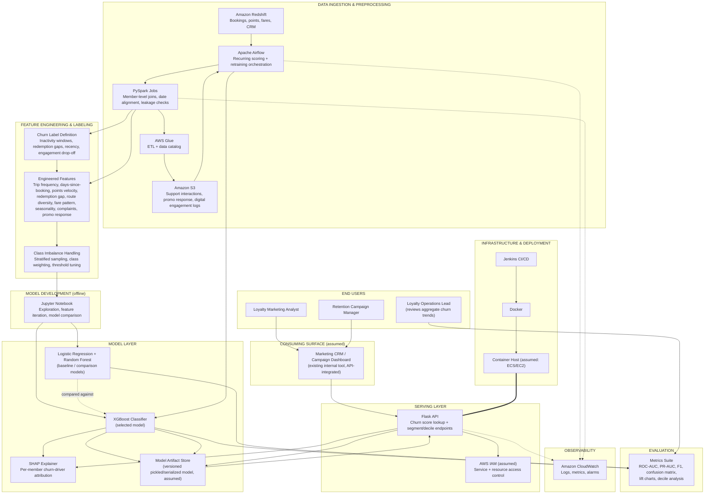
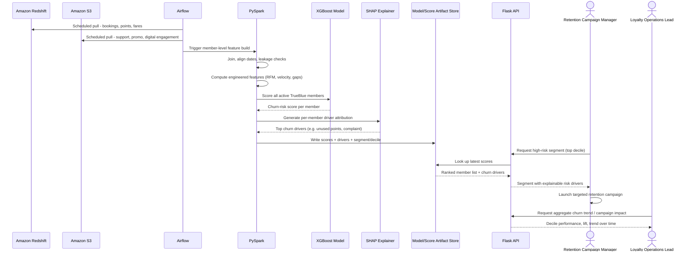

# JetBlue Airways — TrueBlue Loyalty Churn Prediction and Member Retention Analytics Platform — Architecture Deep Dive

**Prepared for:** Emeron Marcelle, Machine Learning Engineer — interview / architecture-review prep
**Project:** TrueBlue Loyalty Churn Prediction and Member Retention Analytics Platform, JetBlue Airways, New York, NY (Mar 2018 – Apr 2020)
**Note on assumptions:** Your resume states the stack (Python, Pandas, NumPy, scikit-learn, XGBoost, Logistic Regression, Random Forest, SHAP, Jupyter Notebook, PySpark, Airflow, Amazon S3, AWS Glue, Amazon Redshift, Flask, Docker, Jenkins, CloudWatch, Git) and the outcomes, but not every low-level design choice, exact team assignment, or delivery date. Anywhere below that goes past what's on the resume is a reasonable, defensible assumption for a system of this type — labeled so you can confirm, adjust, or replace it with what actually happened.

A structural note before diving in: this project is a different shape than the Novartis, NRG, and Volvo projects. There's no LLM, no retrieval, no NLP model of any kind here — this is a **classical structured/tabular ML platform**: batch churn scoring over RFM-style behavioral features, feeding a REST API that marketing and loyalty operations query on their own schedule. It's worth being able to speak to that distinction in an interview: this project demonstrates the foundational data engineering + classical ML + MLOps skill set (feature engineering, model comparison, class-imbalance handling, explainability, batch orchestration) underneath your later NLP and GenAI work — a different kind of rigor than a conversational system, centered on getting a business-actionable score right and explainable, not on generating text.

---

## 1. Architecture Diagram

### Runtime example — from a scheduled scoring run to a campaign manager's segment query

---

## 2. Node-by-Node Breakdown

### 2.1 End Users

**Loyalty Marketing Analyst**
- *What it does:* Reviews churn-risk scores and segment breakdowns to plan which member cohorts get which retention offer.
- *Who's in charge:* JetBlue Loyalty Marketing (business stakeholder, not part of the build team).
- *Phase:* Engaged from Phase 0 (label/requirements definition) through pilot and continuously post-launch.

**Retention Campaign Manager**
- *What it does:* The primary consumer of the top-risk segment — pulls the prioritized, explainable member list to execute targeted outreach and tracks campaign response over time.
- *Who's in charge:* JetBlue Loyalty Marketing / Retention Operations.
- *Phase:* Engaged from pilot onward.

**Loyalty Operations Lead**
- *What it does:* Reviews aggregate churn trends, decile performance, and campaign impact over time to guide broader retention strategy and evaluate whether the model/program is working, not just act on one segment.
- *Who's in charge:* JetBlue Loyalty Operations.
- *Why this role exists in the architecture at all:* Same human-in-the-loop principle seen in the other three projects, calibrated to its own stakes — a churn model that scores well in isolation is worthless if marketing teams don't trust or act on it, so the design deliberately routes both individual-member drivers (via SHAP) and aggregate trend/impact data (via the metrics suite) to a business decision-maker, not just a data science dashboard.
- *Phase:* Engaged from Phase 0, actively involved from Phase 6 (evaluation) onward.

### 2.2 Consuming Surface

**Marketing CRM / Campaign Dashboard (assumed)**
- *What it does:* The existing internal tool loyalty marketing and campaign teams already used daily; this project's scores and segments would realistically be consumed through it via API rather than a brand-new standalone application.
- *Who's in charge:* An existing internal marketing-tools team at JetBlue; this project's responsibility was the Flask API contract it consumed, not the CRM/dashboard itself.
- *Why this is a reasonable assumption:* The resume names Flask as the serving layer but doesn't name a specific consuming front-end — following the same "integrate into an existing workflow tool" pattern used in the Volvo architecture (dealer analysts already lived in the Case Management UI), it's far more realistic that a 2018-era retention marketing team already had a CRM/campaign tool than that this project shipped its own UI.
- *Phase:* Phase 7 (Serving & Integration).

### 2.3 Serving Layer

**Flask API**
- *What it does:* Exposes churn scores, segment/decile lookups, and per-member SHAP driver output as REST endpoints, so the CRM/dashboard (and potentially other internal tools) can pull current risk data on demand.
- *Who's in charge:* You, as the engineer who built and deployed the scoring API.
- *Why Flask over alternatives (FastAPI, calling a scoring script/output file directly):* Flask is what's actually on the resume, and it's a reasonable fit here — the API surface is narrow (score lookup, segment endpoints, not many concurrent async workloads or complex request/response typing), which is exactly the kind of scope where Flask's lower ceremony is a legitimate choice rather than reaching for FastAPI's async/schema-validation machinery the way the Novartis and NRG copilots did for a much higher-throughput, more complex conversational API surface.
- *Phase:* Phase 7, and used continuously post-launch.

**AWS IAM (assumed)**
- *What it does:* Controls which services and users can invoke the API and access underlying AWS resources (Redshift, S3, the model artifact store).
- *Who's in charge:* Cloud/DevOps engineers on the team.
- *Why this is a reasonable assumption:* The resume's Environment list for this project doesn't name IAM explicitly, but any AWS-hosted service handling member-level loyalty and travel data would need baseline IAM-based access control — included here as a minimum-viable-security assumption, not a stated fact, consistent with the same assumption made in the Volvo architecture doc.
- *Phase:* Phase 2 (Core Infrastructure Setup).

### 2.4 Churn Label Definition & Feature Engineering

**Churn Label Definition**
- *What it does:* Defines the actual target variable the model learns — a "churned" TrueBlue member is one who crosses defined thresholds for inactivity, redemption gap, and booking recency, rather than someone who formally cancels an account (loyalty programs rarely have a clean cancellation event the way a subscription product does).
- *Who's in charge:* You, working with Loyalty Marketing/Operations stakeholders to define thresholds that reflect real disengagement rather than an arbitrary cutoff.
- *Why this is its own architectural concern, not just a data step:* This is the single highest-leverage modeling decision in the whole system — get the label wrong (windows too short, confusing seasonal travel gaps with real disengagement) and every downstream metric, however good it looks, is measuring the wrong thing. See Section 3 for the seasonality tension this creates.
- *Phase:* Phase 0 (Discovery & Label Definition).

**Engineered Features**
- *What it does:* Builds the member-level feature set the models actually train on: trip frequency, days since last booking, points-earning velocity, redemption gap, route diversity, fare pattern, seasonal travel behavior, complaint count, and promotion interaction history — a mix of RFM-style behavioral features and airline-specific engagement signals.
- *Who's in charge:* You, with the underlying joins/aggregations executed via PySpark.
- *Why call this out as its own node rather than folding it into data ingestion:* Feature design is where domain knowledge about airline loyalty behavior actually enters the model — a generic "days since last transaction" feature from an e-commerce churn template wouldn't capture that a business traveler's booking cadence looks nothing like a leisure traveler's, which is exactly why route diversity, fare pattern, and seasonal behavior are engineered as distinct features rather than left for a generic recency feature to approximate.
- *Phase:* Phase 2 (Feature Engineering), overlapping with Phase 1's pipeline build.

**Class Imbalance Handling**
- *What it does:* Applies stratified sampling, class weighting, and threshold tuning so the model doesn't default to the trivial "predict no one churns" solution that would still score deceptively well on raw accuracy, given that most members don't churn in any given scoring window.
- *Who's in charge:* You.
- *Why this is its own node, not a generic technique footnote:* This is a named, specific resume bullet with real business consequences if skipped — an unweighted model trained on a heavily imbalanced churn label would produce a high-accuracy, business-useless model that never flags anyone as high-risk, which is precisely why precision-recall analysis (not just ROC-AUC) drove the tuning here. See Section 3.
- *Phase:* Phase 4 (Model Development), alongside model comparison.

### 2.5 Model Layer

**Logistic Regression + Random Forest (baseline / comparison models)**
- *What it does:* Serve as the interpretable and mid-complexity baselines XGBoost was evaluated against — Logistic Regression for a fully transparent linear baseline, Random Forest for a mid-complexity, still reasonably interpretable ensemble.
- *Who's in charge:* You.
- *Why compare against these specifically:* Establishing that XGBoost's added complexity was actually earning its keep — without a documented comparison, choosing the more complex model would be an assumption, not a justified decision, which matters directly to the "why XGBoost" reasoning below.
- *Phase:* Phase 4 (Model Development).

**XGBoost Classifier (selected model)**
- *What it does:* The production churn-scoring model, selected over Logistic Regression and Random Forest.
- *Who's in charge:* You, hands-on training and evaluating all three candidates.
- *Why XGBoost over Logistic Regression and Random Forest:* Per the resume's own framing, the model was selected by balancing predictive performance, interpretability, and retention-campaign usability — XGBoost's gradient-boosted trees generally outperform both baselines on tabular data with the kind of nonlinear feature interactions this feature set has (e.g., the interaction between points velocity and redemption gap likely matters more than either alone), at some real cost to direct interpretability compared to Logistic Regression's coefficients. That interpretability gap is exactly why SHAP is a load-bearing part of this architecture rather than a nice-to-have — see below.
- *Phase:* Phase 4, weeks continuing into Phase 5 (Imbalance Handling & Tuning).

**SHAP Explainer**
- *What it does:* Produces per-member, per-prediction attribution — surfacing which specific factors (declining booking frequency, unused points balance, reduced redemption activity, recent complaints, weak promotion response) drove that member's churn score.
- *Who's in charge:* You.
- *Why SHAP over alternatives (feature importance alone, no explainability layer):* Global feature importance tells you what matters on average across the whole model; it doesn't tell a campaign manager *why this specific member* scored high-risk, which is what they actually need to choose the right retention offer (a member flagged for unused points needs a different outreach than one flagged for a recent complaint) — this is the mechanism that makes an XGBoost model's predictions usable and trustworthy to a non-technical business team, addressed further in Section 3.
- *Phase:* Phase 6 (Explainability), following model selection.

**Model Artifact Store (assumed)**
- *What it does:* Holds the trained, versioned model the Flask API loads to serve scores, and the batch-generated scores/SHAP outputs from the most recent Airflow run.
- *Who's in charge:* You / DevOps.
- *Why this is a reasonable assumption:* The resume doesn't name a specific artifact store (e.g., S3-backed model versioning, a model registry), but some persistence layer between "Airflow finishes a scoring run" and "Flask API serves current scores" is structurally necessary — the most natural fit given the rest of the AWS-based stack is S3-backed storage, included here as an assumption rather than a stated fact.
- *Phase:* Phase 7 (Serving & Integration).

### 2.6 Model Development (Offline)

**Jupyter Notebook**
- *What it does:* The exploratory environment where feature ideas were iterated on, candidate models were compared, and early evaluation metrics were reviewed before anything was formalized into the production PySpark/Airflow pipeline.
- *Who's in charge:* You.
- *Why this is worth its own node:* It's explicitly on the resume's Environment list and represents a distinct phase of work from the production pipeline — the exploratory, iterative model-comparison process (bullet 4's LR vs. RF vs. XGBoost evaluation) realistically happened here first, with only the finalized feature logic and model graduating into the scheduled PySpark/Airflow production path.
- *Phase:* Phase 3–4 (Model Development), preceding productionization.

### 2.7 Data Ingestion & Preprocessing

**Apache Airflow**
- *What it does:* Orchestrates the recurring pipeline — pulling fresh Redshift/S3 data, triggering PySpark feature builds, running scheduled scoring with the production XGBoost model, and writing refreshed scores for the Flask API to serve.
- *Who's in charge:* You / Data Engineers.
- *Why Airflow over alternatives (cron jobs, a simple scheduled script):* Airflow's DAG model makes the dependency chain (data pull → feature build → scoring → SHAP attribution → artifact write) explicit and independently retryable — with several stages that can each fail independently (a Redshift query timeout looks very different from a model-scoring failure), a set of unconnected cron jobs would make failures much harder to trace and recover from.
- *Phase:* Phase 1 (Data Pipeline Build).

**PySpark**
- *What it does:* Assembles the member-level training and scoring dataset — joining booking, points, support, and promotion data, aligning dates across sources, and running leakage checks so the model never trains on information that wouldn't actually be available at scoring time.
- *Who's in charge:* You / Data Engineers.
- *Why PySpark over alternatives (single-machine Pandas preprocessing):* TrueBlue's full member base across booking, points, support, and engagement history is a large, multi-source join at genuine scale — Pandas on a single machine would strain at that volume, especially for the leakage-check logic that has to reason carefully about "as of the scoring date, what did we actually know" across every joined source. This is also explicitly what the resume calls out — "clean joins, date alignment, and leakage checks" — so it's presented here as the load-bearing data-engineering step it's described as, not a generic ETL footnote.
- *Phase:* Phase 1.

**Amazon Redshift**
- *What it does:* Stores structured booking, points-earning/redemption, and CRM data — the primary source of record for a member's travel and loyalty transaction history.
- *Who's in charge:* Data Engineers.
- *Why Redshift over alternatives (a transactional OLTP database queried directly):* A data warehouse purpose-built for large analytical joins/aggregations across a member's full transaction history is a better fit for the kind of "compute trip frequency and points velocity across years of history for every member" workload this pipeline needs than querying a live transactional system directly, which would also risk contending with production booking traffic.
- *Phase:* Phase 1.

**Amazon S3**
- *What it does:* Stores less structured or event-style data — customer support interaction logs, promotion response events, and digital engagement history — that doesn't naturally live in Redshift's structured tables.
- *Who's in charge:* Data Engineers.
- *Phase:* Phase 1.

**AWS Glue**
- *What it does:* Handles ETL and data cataloging for the S3-stored data, making support/promo/engagement event data queryable and discoverable in a structured way for the PySpark join step.
- *Who's in charge:* Data Engineers.
- *Why Glue over alternatives (custom ETL scripts with no catalog):* A managed catalog matters when the S3-side data spans multiple event types and sources (support tickets, promo responses, digital engagement) with their own schemas — Glue's catalog gives PySpark a consistent, discoverable schema to join against instead of each pipeline stage needing hardcoded knowledge of raw file layouts.
- *Phase:* Phase 1.

### 2.8 Evaluation

**Metrics Suite**
- *What it does:* Evaluates model quality using ROC-AUC, PR-AUC, F1-score, confusion matrix, lift charts, and decile analysis — measuring not just whether the model separates churners from non-churners in the abstract, but specifically how well it prioritizes the members marketing should actually act on first.
- *Who's in charge:* You.
- *Why this many metrics rather than one (e.g., just accuracy or just AUC):* Each metric answers a different question this business use case actually needs answered — ROC-AUC and F1 give a general sense of discrimination and balance, but PR-AUC, lift, and decile analysis are what tell you whether the top-scored segment (the one marketing will actually call) is genuinely enriched for real churners, which matters far more than overall accuracy for a class-imbalanced, action-prioritization use case. See Section 3.
- *Phase:* Phase 5 (Evaluation), and reused every retraining cycle post-launch.

### 2.9 Infrastructure & Deployment Layer

**Docker**
- *What it does:* Containerizes the Flask API (and likely the batch scoring job) for consistent deployment.
- *Who's in charge:* DevOps engineers.
- *Phase:* Phase 2 (Core Infrastructure Setup), used throughout every subsequent phase.

**Jenkins**
- *What it does:* Automates build, test, and deployment of the Flask API and pipeline code.
- *Who's in charge:* DevOps engineers.
- *Why Jenkins over alternatives (GitHub Actions):* Jenkins is what's actually on the resume for this project — distinct from the GitHub Actions choice in the Volvo and NRG architectures — and is a very typical CI/CD choice for a 2018-era enterprise engineering org with existing on-prem or self-managed CI infrastructure, which fits a period several years before GitHub Actions became the default choice it is today.
- *Phase:* Phase 2, used continuously afterward.

**Container Host (assumed: ECS or EC2)**
- *What it does:* Runs the containerized Flask API in production.
- *Who's in charge:* DevOps engineers.
- *Why this is a reasonable assumption:* The resume lists Docker and Jenkins but doesn't name a specific container-hosting service the way the Volvo and NRG docs name ECS explicitly — some AWS compute target is structurally necessary to actually run the container, included here as an assumption consistent with the rest of the AWS-based stack (Redshift, S3, Glue).
- *Phase:* Phase 2, weeks continuing through Phase 7.

### 2.10 Observability Layer

**Amazon CloudWatch**
- *What it does:* Collects logs and metrics from the Flask API, Airflow pipeline runs, and PySpark jobs — latency, error rates, pipeline failures, and scoring-job completion status.
- *Who's in charge:* DevOps engineers, with dashboards reviewed by you.
- *Phase:* Phase 2 (baseline), expanded through later phases.

---

## 3. Loyalty/Airline-Specific Details Woven Into the Architecture

Concepts specific to airline loyalty programs and retention marketing that shape this design, distinct from the pharma, energy-retail, and automotive-warranty contexts of your other three projects:

**Churn as an engineered proxy, not a formal event.** Unlike a subscription business where "churn" is a clean, unambiguous cancellation event, a TrueBlue member doesn't formally quit the loyalty program when they disengage — they just stop booking, stop redeeming, and go quiet. This is the direct reason label definition (inactivity windows, redemption gaps, booking recency, engagement drop-off) is its own significant piece of the architecture rather than a trivial data-pull — get the thresholds wrong and the model learns to predict the wrong thing entirely, with no formal "ground truth" event to fall back on for validation.

**Seasonality as a genuine confound, not just noise.** Airline travel is inherently seasonal — a member who flies heavily over the winter holidays and then goes quiet for two months isn't necessarily disengaging, they're behaving like a normal seasonal traveler. This is a real tension the "days since last booking" feature alone can't resolve, which is exactly why seasonal travel behavior is called out as its own engineered feature (bullet 3) rather than trusting a raw recency feature to implicitly capture it — and it's a reason the label-definition windows (bullet 1) had to be chosen carefully enough to not misclassify normal seasonal lulls as disengagement.

**Class imbalance is a business constraint, not just a modeling technique.** In any given scoring window, the large majority of TrueBlue members are not at churn risk — a naively trained model would learn that predicting "not churning" for everyone scores deceptively well on raw accuracy while being completely useless to marketing. This is why the resume explicitly calls out precision-recall analysis and threshold tuning rather than stopping at accuracy or even plain ROC-AUC — marketing teams have finite outreach capacity, so what actually matters is whether the top-decile, highest-scored segment is genuinely enriched for real churners (which is what lift and decile analysis directly measure), not how the model performs in aggregate across the whole imbalanced population.

**SHAP as an adoption mechanism, not a modeling nicety.** A churn score a marketing team can't explain is a score they won't fully trust or act on decisively — if a campaign manager can't tell whether a flagged member is at risk because of a lapsed points balance versus a recent complaint, they can't choose the right retention lever. This is the same "make predictions trustworthy to a non-technical business team" principle seen in the Volvo architecture's classification confidence, applied here at the level of individual feature attribution — SHAP's per-member driver output is what turns "this member scored 0.83" into "this member scored high-risk because their points balance has been unused for 90+ days and they haven't redeemed in over a year," which is directly actionable in a way a bare probability score isn't.

**Data spans multiple internal systems with different grains.** Booking/points/fare data (Redshift) is transactional and well-structured; support interactions, promotion response, and digital engagement (S3) are more event-like and less uniformly structured. This is the practical reason the PySpark join/date-alignment/leakage-check stage is as significant a piece of this architecture as the modeling itself — assembling one coherent, leakage-free, member-level training row out of sources with genuinely different grains and update cadences is a nontrivial data engineering problem in its own right, distinct from the feature design or model selection questions.

---

## 4. Delivery Timeline Summary

| Phase | Focus | Primary Owner(s) | Approx. Duration |
|---|---|---|---|
| 0 — Discovery & Label Definition | Define churn label thresholds (inactivity, redemption gap, recency) with Loyalty Marketing/Operations stakeholders | You, Loyalty Marketing/Operations | Months 1–2 |
| 1 — Data Pipeline Build | Airflow orchestration, PySpark joins/date alignment/leakage checks, Redshift + S3 + Glue integration | Data Engineers, you | Months 2–5 |
| 2 — Core Infrastructure Setup | IAM, Docker, Jenkins CI/CD, CloudWatch baseline | DevOps Engineers | Months 3–6 (overlaps Phase 1) |
| 3 — Feature Engineering & Exploration | Engineer RFM/behavioral features in Jupyter, iterate against the label | You | Months 4–8 |
| 4 — Model Development & Comparison | Train/compare Logistic Regression, Random Forest, XGBoost in scikit-learn | You | Months 7–11 |
| 5 — Class Imbalance Handling & Threshold Tuning | Stratified sampling, class weighting, precision-recall-driven threshold selection | You | Months 10–13 |
| 6 — Evaluation & Explainability | ROC-AUC/PR-AUC/F1/confusion matrix/lift/decile analysis; SHAP driver attribution | You | Months 12–15 |
| 7 — Serving & Integration | Flask API, Airflow-scheduled recurring scoring, model artifact store, CRM/dashboard integration | You, DevOps | Months 14–18 |
| 8 — Pilot with Loyalty Marketing | Real campaign managers act on real high-risk segments in a controlled rollout | Loyalty Marketing, QA | Months 17–20 |
| 9 — Production Rollout & Hypercare | Full rollout, elevated monitoring, fast-response support | Full team | Months 19–22 |
| 10 — Continuous Monitoring & Retraining | Ongoing retraining as member behavior and campaign response patterns evolve | You, full team | Months 22 – Apr 2020 (end of engagement) |

Total time to initial production go-live: **roughly 18 months**, with continuous monitoring and retraining for the remainder of the engagement — consistent with a role that ran from March 2018 to April 2020.

---

## 5. How to Use This Document

As with the other three architecture documents, everything past what your resume states directly — team assignments, phase durations, the assumed consuming CRM/dashboard, container-hosting target, IAM detail, and the specific trade-off reasoning — is a well-reasoned assumption built to be consistent with the stack and outcomes described, not a transcript of what actually happened at JetBlue. Decide which parts match your real experience closely enough to state as fact in an interview, and which you'd want to soften or replace with what you actually remember.
