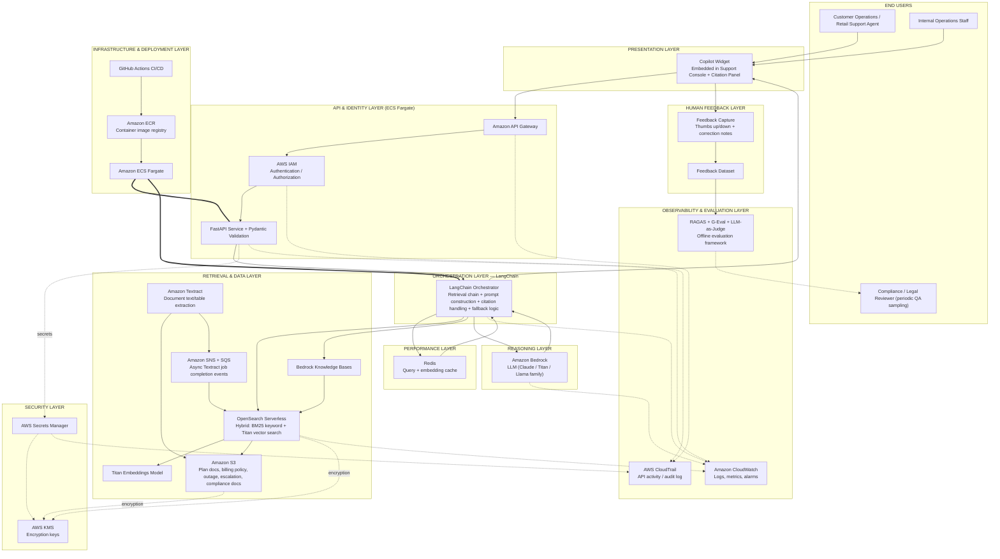
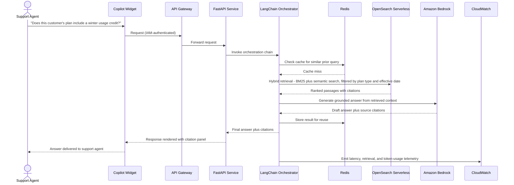

# NRG Energy Retail & Operations Knowledge Copilot — Architecture Deep Dive

**Prepared for:** Emeron Marcelle, Senior GenAI Engineer — interview / architecture-review prep
**Project:** Energy Retail & Operations Knowledge Copilot, NRG Energy, Houston, TX (Jul 2022 – Aug 2024)
**Note on assumptions:** Your resume states the stack (LangChain, Amazon Bedrock, Titan Embeddings, OpenSearch Serverless, S3/Textract, ECS Fargate, IAM/KMS/Secrets Manager, CloudWatch/CloudTrail, RAGAS/G-Eval) and the outcome, but not every low-level design choice, exact team assignment, or delivery date. Anywhere below that goes past what's on the resume is a reasonable, defensible assumption for a system of this type — labeled so you can confirm, adjust, or replace it with what actually happened.

---

## 1. Architecture Diagram

### Runtime example — how one billing question actually flows through the system

---

## 2. Node-by-Node Breakdown

### 2.1 End Users

**Customer Operations / Retail Support Agent**
- *What it does:* The primary user — asks the copilot questions while helping a customer with billing, plan, or outage questions in real time.
- *Who's in charge:* NRG Customer Operations organization (business stakeholder, not part of the build team).
- *Phase:* Engaged from Phase 0 (requirements) through pilot/UAT and continuously post-launch.

**Internal Operations Staff**
- *What it does:* Uses the copilot for internal operational questions — escalation playbooks, internal process guidance — rather than direct customer-facing billing questions.
- *Who's in charge:* NRG Retail Operations organization.

**Compliance / Legal Reviewer**
- *What it does:* Periodically samples copilot answers — especially anything touching billing, rate plans, or regulatory disclosures — to confirm they're accurate and compliant, rather than reviewing every single answer before it reaches an agent.
- *Who's in charge:* NRG Legal/Regulatory Affairs.
- *Why periodic sampling over per-answer sign-off (contrast with the Novartis project):* Unlike the GxP-regulated Novartis copilot, where a human had to approve every consequential output before it became an official record, this is an internal support tool assisting an agent who still talks to the customer — the regulatory stakes of a single wrong answer are lower and the query volume is far higher, so continuous statistical QA sampling plus a strong evaluation framework (RAGAS/G-Eval) was the practical choice instead of a mandatory per-query human gate, which would have made the tool too slow to be useful.
- *Phase:* Engaged during Phase 6 (Evaluation & Compliance Review) and on an ongoing sampling basis after launch.

### 2.2 Presentation Layer

**Copilot Widget**
- *What it does:* A chat-style panel embedded directly into the support console/CRM the agents already use, showing the answer plus a citation panel linking back to the source policy or procedure.
- *Who's in charge:* A front-end/product partner team, with the API contract defined jointly with you.
- *Why embedded-in-console over a standalone app:* Support agents work inside one primary tool all day; a separate application would add a context switch that measurably slows down handle time, which was one of the core metrics this project was meant to improve.
- *Phase:* Phase 5 (Feedback & UI Integration), weeks 24–30.

### 2.3 API & Identity Layer

**Amazon API Gateway**
- *What it does:* The managed entry point for all requests from the copilot widget; handles routing, throttling, and request validation before traffic reaches the application layer.
- *Who's in charge:* Cloud/DevOps Engineers.
- *Why this over alternatives (exposing ECS Fargate directly, an Application Load Balancer alone):* API Gateway adds built-in throttling and request validation and integrates cleanly with IAM-based auth, which reduces the amount of custom gatekeeping code the FastAPI service itself has to implement.
- *Phase:* Phase 2 (Core Infrastructure & Security Setup), weeks 7–12.

**FastAPI Service + Pydantic Validation**
- *What it does:* The application layer that receives the validated request and invokes the LangChain orchestration chain; Pydantic enforces that every request/response matches a strict, typed schema.
- *Who's in charge:* You and the GenAI/ML Engineers on the team.
- *Why FastAPI + Pydantic over alternatives (Flask, Django REST):* Async support matters here for the same reason it did at Novartis — a request involves several slow downstream calls (cache check, retrieval, LLM generation) — and Pydantic's strict schema validation catches malformed requests before they reach the more expensive retrieval/generation steps.
- *Phase:* Phase 2, weeks 7–12.

**AWS IAM**
- *What it does:* Authenticates and authorizes every request and every service-to-service call (who can invoke the API, which service can read from which S3 bucket, etc.).
- *Who's in charge:* Cloud/DevOps Engineers, with policy review from the AWS platform team.
- *Why this over alternatives (a custom auth layer):* IAM is the native, already-adopted identity system across NRG's AWS footprint; building a parallel auth system would duplicate work AWS already provides and would need its own security review.
- *Phase:* Phase 2, weeks 7–12.

### 2.4 Orchestration Layer

**LangChain Orchestrator**
- *What it does:* Chains together the retrieval call, prompt construction, citation formatting, and fallback logic (what happens if retrieval returns nothing confident) into one coherent request-handling flow.
- *Who's in charge:* You, as the engineer who designed the end-to-end RAG architecture.
- *Why LangChain over alternatives (hand-rolled orchestration code, LlamaIndex):* LangChain's chain abstraction fit a fairly linear request flow (retrieve, construct prompt, generate, format citations) well without needing the graph/loop capabilities of something like LangGraph, and it has strong out-of-the-box integration with Bedrock and OpenSearch, reducing custom integration code.
- *Phase:* Phase 4 (RAG Orchestration & Retrieval Build), weeks 14–24.

### 2.5 Reasoning Layer

**Amazon Bedrock**
- *What it does:* Hosts the LLM that generates the final grounded answer from the retrieved context.
- *Who's in charge:* You selected the platform; GenAI/ML Engineers handled prompt design and evaluation.
- *Why Bedrock over alternatives (calling the OpenAI API directly, self-hosting an open-source model):* NRG's infrastructure was already AWS-centric, so Bedrock let the team access multiple foundation models (Titan, Claude, Llama) through one managed, IAM-governed service without standing up separate hosting infrastructure or sending customer/billing data to a non-AWS endpoint outside the existing security boundary.
- *Phase:* Phase 3–4 (access provisioned during infra setup, wired into the orchestrator during Phase 4), weeks 10–24.

### 2.6 Retrieval & Data Layer

**Bedrock Knowledge Bases**
- *What it does:* Manages the connective tissue between ingested documents and retrieval-ready vector data, automating chunking and embedding generation as part of the Bedrock ecosystem.
- *Who's in charge:* Data Engineers.
- *Why this over alternatives (building a fully custom ingestion-to-embedding pipeline):* Using the managed Knowledge Bases capability meant less custom pipeline code to build and maintain for the chunking/embedding hand-off specifically, letting the team focus engineering effort on the harder problem — hybrid retrieval quality — instead of re-solving a largely solved integration problem.
- *Phase:* Phase 3 (Ingestion Pipeline Build), weeks 10–18.

**OpenSearch Serverless (hybrid retrieval)**
- *What it does:* Indexes both keyword (BM25) and vector (semantic) representations of every document chunk, and serves hybrid retrieval queries combining both.
- *Who's in charge:* Data Engineers and you (retrieval strategy design).
- *Why hybrid over pure semantic search:* Billing and plan documents are full of exact terminology — rate codes, specific plan names, dollar figures — that paraphrase-tolerant semantic search alone can miss or blur; combining it with BM25 keyword matching recovers exact-term precision while semantic search still handles paraphrased customer questions.
- *Why OpenSearch Serverless over alternatives (Pinecone, a self-managed OpenSearch cluster):* Serverless removes the cluster-sizing and scaling operational burden, and it's natively part of the AWS ecosystem NRG already used, avoiding a separate vendor relationship and data-residency conversation for customer billing data.
- *Phase:* Phase 3, weeks 10–18.

**Titan Embeddings**
- *What it does:* Converts each document chunk (and each incoming query) into a vector representation for the semantic half of hybrid retrieval.
- *Who's in charge:* Data Engineers.
- *Why Titan over alternatives (OpenAI embeddings, an open-source embedding model):* Titan Embeddings is natively available inside Bedrock, keeping the embedding step inside the same managed, IAM-governed environment as everything else rather than adding a separate external embedding API call.
- *Phase:* Phase 3, weeks 10–18.

**Amazon S3**
- *What it does:* Stores the raw source documents — retail energy plan documents, billing policies, outage procedures, escalation playbooks, and compliance guidance — before and after processing.
- *Who's in charge:* Data Engineers, Cloud/DevOps Engineers (bucket policies).
- *Why this over alternatives (a file share, SharePoint as the source store):* S3 integrates directly with Textract and the Knowledge Bases ingestion pipeline via event notifications, scales without practical limits, and supports the encryption-at-rest (via KMS) and fine-grained bucket policies needed for customer-related documents.
- *Phase:* Phase 3, weeks 10–18.

**Amazon Textract**
- *What it does:* Extracts text, tables, and form fields from plan documents and policies, many of which are PDF-based and not cleanly machine-readable as-is.
- *Who's in charge:* Data Engineers.
- *Why this over alternatives (open-source OCR, Azure Document Intelligence):* Staying inside AWS kept document processing in the same IAM/KMS-governed boundary as storage and retrieval, and Textract's native S3 event integration made triggering extraction on new document uploads straightforward.
- *Phase:* Phase 3, weeks 10–18.

**Amazon SNS + SQS (assumed)**
- *What it does:* Textract's asynchronous API (used for multi-page documents) publishes a completion notification via SNS, which is typically consumed through an SQS queue to trigger the next step — re-embedding and re-indexing the newly processed document.
- *Who's in charge:* Cloud/DevOps Engineers, Data Engineers.
- *Why this over alternatives (polling Textract for job status):* Event-driven notification avoids wasteful polling and keeps document updates flowing into the index promptly — this is the same "how does the system automatically update when documents change" pattern discussed earlier, applied concretely here.
- *Phase:* Phase 3, weeks 10–18. *(This specific messaging detail isn't named in your resume — it's the standard, well-documented pattern for Textract's async multi-page processing API, included here for architectural completeness.)*

### 2.7 Performance Layer

**Redis**
- *What it does:* Caches embeddings and/or full responses for frequently repeated queries — a large share of customer billing questions are variations on the same handful of topics.
- *Who's in charge:* GenAI/ML Engineers.
- *Why Redis over alternatives (no caching layer, a database-backed cache):* An in-memory store gives sub-millisecond cache lookups, which matters directly for a support-agent-facing tool where every extra second of latency is time a customer is on hold; a disk-backed cache wouldn't meaningfully beat just re-running retrieval in this latency-sensitive context.
- *Phase:* Phase 5 (Performance & Feedback Integration), weeks 24–30.

### 2.8 Human Feedback Layer

**Feedback Capture**
- *What it does:* Lets an agent flag whether an answer was helpful/accurate directly in the UI, plus free-text correction notes.
- *Who's in charge:* Product Owner (workflow design), GenAI/ML Engineers (implementation).
- *Phase:* Phase 5, weeks 24–30.

**Feedback Dataset**
- *What it does:* Aggregates flagged answers over time into a dataset used to identify systematic gaps (a specific plan type consistently getting wrong answers, for example).
- *Who's in charge:* Data Engineers, you (analysis and prioritization of fixes).
- *Why capturing this over relying on evaluation metrics alone:* Offline evaluation (RAGAS/G-Eval) measures against a fixed test set; live agent feedback catches real-world gaps the test set didn't anticipate, which matters because customer questions and plan documents both change over time.
- *Phase:* Phase 6 (Evaluation Framework & Compliance Review), weeks 24–32, ongoing after launch.

### 2.9 Security Layer

**AWS KMS**
- *What it does:* Manages the encryption keys protecting data at rest in S3 and OpenSearch.
- *Who's in charge:* Cloud/DevOps Engineers, with the AWS platform team's key-policy approval.
- *Why this over alternatives (application-level encryption):* KMS centralizes key management and rotation and is the standard, auditable approach AWS security reviews expect, rather than each service implementing its own encryption logic.
- *Phase:* Phase 2, weeks 7–12.

**AWS Secrets Manager**
- *What it does:* Stores API keys and connection strings so the FastAPI service never has them hardcoded or in environment files checked into source control.
- *Who's in charge:* Cloud/DevOps Engineers.
- *Phase:* Phase 2, weeks 7–12.

### 2.10 Infrastructure & Deployment Layer

**Amazon ECS Fargate**
- *What it does:* Runs the containerized FastAPI/LangChain service without the team needing to manage underlying EC2 instances.
- *Who's in charge:* Cloud/DevOps Engineers, with the AWS platform team for account-level networking/VPC setup.
- *Why Fargate over alternatives (self-managed EC2 + ECS, AWS Lambda):* Fargate removes server management entirely (versus EC2), while Lambda's execution-time limits and cold-start latency made it a poor fit for a service doing LLM calls that can run long and need to stay warm for acceptable response times.
- *Phase:* Phase 2, weeks 7–12; used throughout every subsequent phase.

**Amazon ECR (assumed)**
- *What it does:* Stores the built Docker images before they're deployed to ECS Fargate.
- *Who's in charge:* Cloud/DevOps Engineers.
- *Why this over alternatives (Docker Hub):* Keeping images in a private, AWS-native registry avoids external dependencies and integrates directly with ECS task definitions and IAM-based pull permissions. *(Not explicitly named on your resume — the standard companion service to ECS Fargate, included for completeness.)*
- *Phase:* Phase 2, weeks 7–12.

**GitHub Actions**
- *What it does:* Automates build, test, and deployment of the service to ECR/ECS.
- *Who's in charge:* Cloud/DevOps Engineers, with test gates defined alongside QA.
- *Phase:* Phase 2 (pipeline established), weeks 7–12; used continuously afterward.

### 2.11 Observability & Evaluation Layer

**Amazon CloudWatch**
- *What it does:* Collects logs, latency metrics, and error rates across the FastAPI service, LangChain calls, Bedrock invocations, and OpenSearch queries; powers alarms for anomalies.
- *Who's in charge:* Cloud/DevOps Engineers, with dashboards reviewed by you and the Product Owner.
- *Phase:* Phase 2 (baseline), weeks 7–12; expanded through later phases.

**AWS CloudTrail**
- *What it does:* Logs API-level account activity for audit readiness — who accessed what, when, at the AWS account level.
- *Who's in charge:* Cloud/DevOps Engineers, reviewed periodically by Compliance/Legal.
- *Why this matters here (versus a purely internal tool):* Even without GxP-style regulation, retail energy is a regulated consumer-facing industry — being able to show an audit trail of system access supports both internal security reviews and any regulatory inquiry into how customer data was handled.
- *Phase:* Phase 2, weeks 7–12.

**RAGAS + G-Eval + LLM-as-Judge**
- *What it does:* The offline evaluation framework run before any release — scoring faithfulness, answer relevancy, context precision/recall, and citation accuracy against a curated test set of realistic billing/outage/plan questions.
- *Who's in charge:* You designed the evaluation approach; GenAI/ML Engineers built and ran it; Compliance/Legal reviewed results for anything touching regulated billing disclosures.
- *Why this over alternatives (manual QA spot-checks only):* Manual spot-checking alone doesn't scale and isn't repeatable across releases; an automated, metric-based framework lets the team catch a regression (a change that hurts grounding or accuracy) before it reaches production, and gives Compliance a quantified basis for sign-off rather than a subjective impression.
- *Phase:* Phase 6 (Evaluation Framework & Compliance Review), weeks 24–32, and re-run for every meaningful release afterward.

---

## 3. Energy Retail-Specific Details Woven Into the Architecture

A few concepts specific to the retail energy industry that shape the design, distinct from the GxP-pharma context of the Novartis project:

**Deregulated retail electricity market (ERCOT / PUCT).** NRG operates as a retail electricity provider primarily in Texas's deregulated market, where customers choose their electricity provider and plan rather than being served by a single regulated utility. This market is overseen by the Public Utility Commission of Texas (PUCT), with ERCOT managing the grid itself. It's why plan documents and billing policies are such a heavily used document category here — customers and support agents alike are dealing with a genuine marketplace of differentiated plans, not a single fixed rate.

**Electricity Facts Label (EFL) and billing disclosure rules.** Texas retail electricity contracts are required to include a standardized disclosure (the EFL) covering rate structure, fees, and contract terms. A support agent citing outdated or incorrect plan terms isn't just an accuracy problem, it can be a regulatory disclosure issue — which is the specific reason retrieval is metadata-filtered by plan type and effective date, and why Compliance/Legal samples billing-related answers rather than treating them as generic FAQ content.

**Outage communication requirements.** Following high-profile grid events (notably Winter Storm Uri in February 2021), Texas regulators and the public increased scrutiny on how retail providers communicate with customers during outages. This is the regulatory backdrop behind the "outage procedures" and "escalation playbooks" document categories the copilot serves — getting outage guidance right, consistently, and quickly is both an operational and a public-facing reputational concern.

**Customer PII and payment data.** Billing conversations routinely involve personally identifiable information and sometimes payment-related details. This is the practical reason encryption via KMS, strict IAM scoping, and CloudTrail audit logging are treated as non-negotiable rather than nice-to-haves, even though this system is not subject to something like 21 CFR Part 11 the way the Novartis project was.

**Lower per-answer human-review burden than a GxP system, but not zero.** Unlike the Novartis copilot, no single wrong answer here typically has the same regulatory weight as a mishandled pharmaceutical batch deviation — so the design leans on a strong offline evaluation framework (RAGAS/G-Eval) plus statistical sampling by Compliance/Legal, rather than mandatory human sign-off on every response. That's a deliberate, risk-proportional design choice, not a shortcut — it's the same underlying principle (governance proportional to regulatory and safety stakes) applied differently because the stakes themselves are different.

---

## 4. Delivery Timeline Summary

| Phase | Focus | Primary Owner(s) | Approx. Duration |
|---|---|---|---|
| 0 — Discovery & Requirements | Identify document types in scope, define what a "good answer" looks like with Customer Ops | Product Owner, Project Manager, you | Weeks 1–4 |
| 1 — Architecture & Security Design | RAG architecture, hybrid retrieval strategy, AWS security model | You, AWS platform team | Weeks 5–8 |
| 2 — Core Infrastructure & Security Setup | ECS Fargate, ECR, API Gateway, IAM, KMS, Secrets Manager, CI/CD, CloudWatch/CloudTrail baseline | Cloud/DevOps Engineers | Weeks 7–12 (overlaps Phase 1) |
| 3 — Ingestion Pipeline Build | S3, Textract, Titan Embeddings, OpenSearch indexing, Bedrock Knowledge Bases | Data Engineers | Weeks 10–18 |
| 4 — RAG Orchestration & Retrieval Build | LangChain chains, hybrid BM25 + semantic retrieval, Bedrock integration | You, GenAI/ML Engineers | Weeks 14–24 |
| 5 — Performance & Feedback Integration | Redis caching, feedback capture UI, support-console embedding | GenAI/ML Engineers, front-end partner team | Weeks 24–30 |
| 6 — Evaluation Framework & Compliance Review | RAGAS/G-Eval/LLM-as-judge, Legal/Compliance sampling of billing-related answers | You, GenAI/ML Engineers, Compliance/Legal | Weeks 24–32 |
| 7 — Pilot / UAT with Customer Ops | Real support agents test real customer scenarios in a controlled rollout | Product Owner, Customer Operations SMEs | Weeks 30–36 |
| 8 — Production Go-Live & Hypercare | Rollout, elevated monitoring, fast-response support | Full team | Weeks 36–40 |
| 9 — Continuous Monitoring & Enhancement | New document categories, model updates, ongoing evaluation reruns | You, full team | Month ~9 – Aug 2024 (end of engagement) |

Total time to initial production go-live: **roughly 8–9 months**, with continuous enhancement for the remainder of the engagement — consistent with a role that ran from July 2022 to August 2024.

---

## 5. How to Use This Document

As with the Novartis document, everything past what your resume states directly — team assignments, phase durations, the SNS/SQS async-notification detail, specific trade-off reasoning — is a well-reasoned assumption built to be consistent with the stack and outcomes described, not a transcript of what actually happened at NRG Energy. Decide which parts match your real experience closely enough to state as fact in an interview, and which you'd want to soften or replace with what you actually remember.
