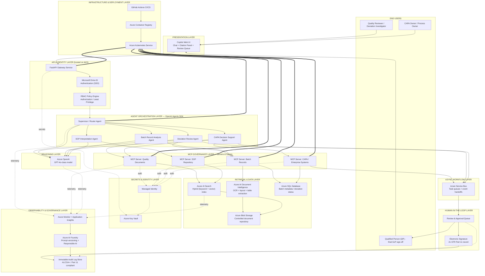
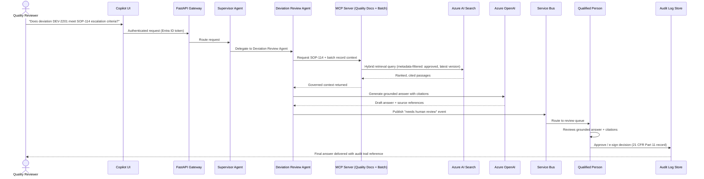

# Novartis Multi-Agent CMC Manufacturing Quality Copilot — Architecture Deep Dive

**Prepared for:** Emeron Marcelle, Lead AI Scientist — interview / architecture-review prep
**Project:** Multi-Agent CMC Manufacturing Quality Copilot, Novartis (Sep 2024 – Present)
**Note on assumptions:** Your resume describes *what* was built and the Azure/Agents-SDK stack behind it, but not every low-level design decision, exact staffing assignment, or delivery date. Everywhere this document goes below that level of detail, it is a reasonable, defensible assumption for a system of this type and scale — each one is labeled and explained so you can confirm, correct, or replace it with what actually happened before repeating it in an interview.

---

## 1. Architecture Diagram

### Runtime example — how one deviation-review question actually flows through the system

---

## 2. Node-by-Node Breakdown

Each entry follows the same structure: **What it does** · **Who's in charge** · **Why this over the alternatives** · **Delivery phase & timeframe**.

### 2.1 End Users

**Quality Reviewer / Deviation Investigator**
- *What it does:* The primary human user — asks the copilot questions during a deviation investigation, batch record review, or SOP lookup.
- *Who's in charge:* Novartis CMC Quality organization (business stakeholder, not part of the build team).
- *Why this matters to the design:* Every downstream architectural decision (citations, human review, audit logging) exists to make this person's answer trustworthy and defensible, not just fast.
- *Phase:* Engaged from Phase 0 (requirements) through Phase 7 (UAT) and continuously post-launch as the end user.

**CAPA Owner / Process Owner**
- *What it does:* Owns the corrective/preventive action once a deviation investigation concludes one is needed; uses the CAPA Decision Support Agent to draft and justify CAPA recommendations.
- *Who's in charge:* Novartis Quality/Manufacturing organization.
- *Phase:* Same engagement window as above.

**Qualified Person (QP)**
- *What it does:* The GxP-defined role (a regulatory requirement in pharma manufacturing) with legal authority to certify a batch or approve a quality decision. In this system, the QP is the final human-in-the-loop checkpoint — no agent output becomes an official record until a QP (or delegated reviewer) signs off.
- *Who's in charge:* Novartis Quality Assurance, a named, trained, and formally designated individual per regulatory requirement — **this role cannot be automated away**, by law.
- *Why this over alternatives:* An automation-only design (agent decides, no human sign-off) was never on the table — GxP and FDA/EMA expectations require human accountability for quality decisions. The architecture is built around the QP, not around removing them.
- *Phase:* Involved from Phase 0 (defining what "done" means for each workflow) through ongoing production use.

### 2.2 Presentation Layer

**Copilot Web UI**
- *What it does:* Chat-style interface (per our earlier discussion — it deliberately looks like a normal LLM chat window) with an added citation panel showing source SOP/batch record excerpts, and a review queue view for pending sign-offs.
- *Who's in charge:* A front-end/product engineering partner team, with requirements and API contract defined jointly with you as Lead AI Scientist (what data — citations, confidence, status — the UI needs from the backend).
- *Why this over alternatives:* A chat-first UI was chosen over a traditional form-based "search portal" because the underlying system is conversational/agentic; a form-based UI would have hidden the agent's reasoning and made citations feel bolted-on rather than central.
- *Phase:* Phase 5 (Human-in-the-Loop & Workflow Integration), weeks 24–30.

### 2.3 API & Identity Layer

**FastAPI Gateway Service**
- *What it does:* The single entry point for all UI requests; validates auth tokens, routes requests to the Supervisor Agent, and returns structured responses (answer + citations + status).
- *Who's in charge:* ML/AI Engineers, under your architectural direction.
- *Why FastAPI over alternatives (Flask, Django REST, Node/Express):* FastAPI was chosen for native async support (important when a request may involve multiple slow downstream calls — retrieval, LLM inference, tool calls), automatic OpenAPI schema generation (useful for a governed environment where every endpoint needs to be documented for security review), and built-in request/response validation via Pydantic, which reduces malformed-data risk in a regulated pipeline.
- *Phase:* Phase 2 (Core Infrastructure & Identity Setup), weeks 9–14.

**Microsoft Entra ID (Authentication)**
- *What it does:* Handles user single sign-on and issues identity tokens; confirms *who* is making a request.
- *Who's in charge:* IT Security & Governance reviewers (platform-owned, not project-owned) — the project team integrates against it rather than building it.
- *Why this over alternatives (custom auth, third-party IdP):* Novartis already runs on Microsoft 365/Entra ID enterprise-wide; using it avoids standing up a parallel identity system, and it's the only option Security & Governance would approve for access to regulated systems.
- *Phase:* Phase 2, weeks 9–14.

**RBAC Policy Engine (Authorization)**
- *What it does:* Determines *what* an authenticated user or service is allowed to do — e.g., a Quality Reviewer can view deviation answers; only a QP role can approve/e-sign one.
- *Who's in charge:* Jointly owned by you (defining what roles/permissions the system needs) and IT Security & Governance (approving and provisioning the actual role definitions).
- *Why this over alternatives (hardcoded permission checks in application code):* Centralized RBAC tied to Entra ID roles is auditable and independently reviewable by Security — hardcoded checks scattered through app code would fail a security/compliance review because there's no single source of truth for "who can do what."
- *Phase:* Phase 2, weeks 9–14, refined through Phase 6 (validation).

### 2.4 Agent Orchestration Layer (OpenAI Agents SDK)

**Supervisor / Router Agent**
- *What it does:* Receives the incoming question, decides which specialist agent (or agents) should handle it, and assembles the final response if multiple agents contributed.
- *Who's in charge:* You (Lead AI Scientist) — this is the core orchestration design decision of the whole project.
- *Why a router pattern over alternatives (a single do-everything agent, or a fixed if/else rules engine):* A single monolithic agent with access to every tool would be harder to scope, audit, and validate — Security/Compliance would have to review one agent with unlimited reach instead of four agents each with a narrow, provable scope. A hardcoded rules engine (no agent at all) was rejected because the routing decision itself benefits from language understanding (a question can span deviation + SOP context in ambiguous ways that a rules engine handles poorly).
- *Phase:* Phase 4 (Agent & MCP Development), weeks 15–28.

**Deviation Review Agent, Batch Record Analysis Agent, SOP Interpretation Agent, CAPA Decision Support Agent**
- *What they do:* Four specialist agents, each scoped to one workflow — reviewing deviation reports against criteria, extracting/summarizing batch record data, interpreting SOP language against a specific situation, and drafting CAPA justifications, respectively.
- *Who's in charge:* ML/AI Engineers built each agent's tool bindings and prompts under your architectural direction; Quality/Compliance SMEs validated that each agent's outputs matched real investigative reasoning.
- *Why four specialist agents over one generalist agent:* Matches the MCP scoping principle above — each agent only needs (and is only granted) access to the tools relevant to its job, which is both a security boundary and a way to keep each agent's behavior easier to test, validate, and explain to an auditor.
- *Phase:* Phase 4, weeks 15–28, iterated through Phase 6 validation.

### 2.5 MCP Governance Layer

**MCP Server: Quality Documents / MCP Server: Batch Records / MCP Server: SOP Repository / MCP Server: CAPA & Enterprise Systems**
- *What they do:* Each is a narrow, purpose-built interface that exposes only specific, approved operations (e.g., "search approved SOPs," "fetch batch metadata by ID") to the agents — the agents never get direct, unrestricted database or file-system access.
- *Who's in charge:* You defined the governance boundaries (what each server exposes); ML/AI Engineers implemented the servers; IT Security & Governance reviewed and approved the access scope for each one before go-live.
- *Why MCP over alternatives (agents calling internal REST APIs directly, or a single shared "do anything" tool):* Direct API access from an LLM agent is much harder to govern — you'd need to build the same access-control logic repeatedly inside every agent instead of once, centrally, in the MCP layer. MCP also gives a uniform audit point: every tool call, from every agent, passes through a place where it can be logged and scoped, which is exactly what a GxP audit trail requires.
- *Phase:* Phase 4, weeks 15–28.

### 2.6 Reasoning Layer

**Azure OpenAI (GPT-4o-class model)**
- *What it does:* Generates the natural-language reasoning and final answer text for every agent, grounded in the context the MCP/retrieval layer provides.
- *Who's in charge:* You selected the model/platform; ML/AI Engineers handle prompt design and evaluation.
- *Why Azure OpenAI over alternatives (calling the OpenAI API directly, or a self-hosted open-source model):* Novartis's data residency, security, and compliance requirements for regulated pharmaceutical data effectively rule out sending data to a public, non-enterprise API endpoint. Azure OpenAI runs inside Novartis's own Azure tenant boundary, inherits existing Entra ID/RBAC/Key Vault controls, and offers contractual data-handling guarantees (no training on customer data) that a consumer API doesn't. A self-hosted open-source LLM was likely considered and set aside because of the ongoing MLOps burden of hosting, scaling, and keeping a frontier-quality model current in-house, versus consuming it as a managed service.
- *Phase:* Phase 3–4 (model access provisioned during infra setup, wired into agents during Phase 4), weeks 11–28.

### 2.7 Retrieval & Data Layer

**Azure AI Search**
- *What it does:* Indexes SOPs, batch records, and deviation history for hybrid (keyword + vector) retrieval, with metadata filtering by document type, status, and effective date.
- *Who's in charge:* Data Engineers built and maintain the index and ingestion pipeline; you defined the retrieval strategy (hybrid + metadata filtering) and the freshness/versioning rules.
- *Why this over alternatives (Elasticsearch/OpenSearch self-hosted, Pinecone, a plain SQL full-text search):* Staying inside Azure AI Search kept the retrieval layer inside the same governed, Entra ID/RBAC-integrated environment as everything else — a third-party vector database would have meant a separate security review, separate data-residency justification, and a new integration surface for very little retrieval-quality benefit over Azure's own hybrid + semantic ranking capability.
- *Phase:* Phase 3 (Ingestion & Retrieval Pipeline Build), weeks 11–20.

**Azure AI Document Intelligence**
- *What it does:* Runs OCR plus layout/table/key-value extraction on batch records and quality documents — many of which are scanned, form-based, or contain structured tables that plain text extraction would mangle.
- *Who's in charge:* Data Engineers.
- *Why this over alternatives (a generic/open-source OCR library, Amazon Textract):* Document Intelligence's prebuilt layout and table models handle the structured, form-heavy nature of batch records (fields, tables, signatures) far better than raw OCR, and — same reasoning as Azure AI Search — keeps document content inside the Azure/Entra ID governed boundary rather than crossing into a different cloud provider's service for a system with strict data-residency requirements.
- *Phase:* Phase 3, weeks 11–20.

**Azure Blob Storage**
- *What it does:* Stores the raw source documents (SOPs, batch records, deviation reports) that get processed by Document Intelligence and indexed by AI Search.
- *Who's in charge:* Data Engineers (pipeline), DevOps/Cloud Engineers (storage account provisioning, access policies).
- *Why this over alternatives (a traditional file share, SharePoint as the document store):* Blob Storage integrates natively with Document Intelligence and AI Search indexers (event-driven ingestion is straightforward), scales without the file-count/size limitations of a file share, and supports fine-grained access policies and encryption at rest required for controlled documents.
- *Phase:* Phase 3, weeks 11–20.

**Azure SQL Database**
- *What it does:* Stores structured, relational data — batch metadata, process parameters, deviation categories, and review/approval status — that's better suited to SQL queries than document search.
- *Who's in charge:* Data Engineers.
- *Why SQL over alternatives (Cosmos DB, a NoSQL store):* Batch and deviation metadata is inherently relational (a batch has many deviations, a deviation has a status history, etc.), so a relational model with joins and constraints is a more natural and easier-to-validate fit than a NoSQL document store — and SQL Server/Azure SQL is already Novartis's enterprise standard for this kind of structured operational data.
- *Phase:* Phase 3, weeks 11–20.

### 2.8 Async Workflow Layer

**Azure Service Bus**
- *What it does:* Passes messages/events between components asynchronously — e.g., "agent has produced a draft answer that needs human review," or "a new document was ingested, re-index it."
- *Who's in charge:* DevOps/Cloud Engineers (provisioning), ML/AI Engineers (message contracts/consumers).
- *Why this over alternatives (Azure Event Grid, a direct synchronous API call, Kafka):* Human review can't happen synchronously within a single request — a reviewer might pick up the task minutes or hours later — so an async queue is required by the workflow itself, not just a performance optimization. Service Bus was chosen over Event Grid because it offers guaranteed, ordered delivery and dead-letter queues suited to a workflow (not just a fire-and-forget event) where a message absolutely must not be silently dropped; Kafka was likely passed over as unnecessary operational overhead for this message volume when a native, fully-managed Azure service already meets the requirement.
- *Phase:* Phase 5 (Human-in-the-Loop & Workflow Integration), weeks 24–30.

### 2.9 Human-in-the-Loop Layer

**Review & Approval Queue**
- *What it does:* Surfaces agent-drafted answers awaiting human review, prioritized and routed to the correct reviewer/QP based on workflow type.
- *Who's in charge:* Product Owner (workflow/prioritization rules) and ML/AI Engineers (implementation).
- *Why a queue over alternatives (immediate auto-publish, email-based review):* A structured queue (versus email or ad hoc notification) creates a trackable, reportable backlog — important for both operational management and for demonstrating to auditors that every AI-assisted answer went through review before being acted on.
- *Phase:* Phase 5, weeks 24–30.

**Electronic Signature / 21 CFR Part 11 Record**
- *What it does:* Captures the reviewer's or QP's formal approval as a legally meaningful electronic signature, per FDA 21 CFR Part 11 requirements for electronic records and signatures in regulated industries.
- *Who's in charge:* Quality/Compliance SMEs defined the requirement; ML/AI Engineers and DevOps implemented it, validated by QA/Validation testers against Part 11 requirements specifically (unique user identification, signature meaning, timestamp, tamper-evidence).
- *Why this over alternatives (a simple "approved" checkbox/status flag):* A basic status flag has no legal standing as a signature and wouldn't satisfy an FDA inspection; Part 11 compliance requires specific, auditable properties (who signed, what they were attesting to, when, and proof it wasn't altered afterward) that a generic status field doesn't provide.
- *Phase:* Phase 6 (Computer System Validation & GxP Qualification), weeks 28–40 — this is one of the most heavily scrutinized pieces during validation.

### 2.10 Secrets & Identity Layer

**Azure Key Vault**
- *What it does:* Stores API keys, connection strings, and certificates so they never appear in source code or config files.
- *Who's in charge:* DevOps/Cloud Engineers, with access policy sign-off from IT Security & Governance.
- *Why this over alternatives (environment variables, secrets committed to a private repo):* Environment variables and repo-based secrets are exactly the kind of finding a security/compliance audit flags immediately; Key Vault provides centralized rotation, access logging, and integration with Managed Identity so secrets are never handled by a human or hardcoded at all.
- *Phase:* Phase 2, weeks 9–14.

**Managed Identity**
- *What it does:* Lets each Azure service (the Gateway, the MCP servers) authenticate to other Azure services (Key Vault, SQL, Blob) without any stored credential at all.
- *Who's in charge:* DevOps/Cloud Engineers.
- *Why this over alternatives (service principal with a stored client secret):* A stored client secret is still a credential that can leak or expire and needs rotation; Managed Identity removes that risk category entirely by having Azure itself broker the authentication.
- *Phase:* Phase 2, weeks 9–14.

### 2.11 Infrastructure & Deployment Layer

**Azure Kubernetes Service (AKS)**
- *What it does:* Hosts all the containerized services — the Gateway, the agent orchestration service, and each MCP server — with scaling, health checks, and rolling deployments.
- *Who's in charge:* DevOps/Cloud Engineers, in coordination with the (platform-owned, shared) Azure Platform Team for cluster provisioning and networking.
- *Why AKS over alternatives (Azure App Service, Azure Functions/serverless):* The system is a set of several distinct, independently scalable services (Gateway, orchestrator, four MCP servers) with more complex networking/isolation requirements between them than App Service comfortably supports; Functions/serverless was likely a poor fit for long-running agent reasoning loops that don't match the short-execution, event-triggered model serverless is optimized for.
- *Phase:* Phase 2, weeks 9–14 (cluster provisioned), used through every subsequent phase.

**Azure Container Registry (ACR)**
- *What it does:* Stores the built container images for every service before they're deployed to AKS.
- *Who's in charge:* DevOps/Cloud Engineers.
- *Why this over alternatives (Docker Hub, a public registry):* A private, Azure-native registry keeps container images inside the same compliance boundary and integrates directly with AKS pull permissions via Managed Identity, rather than relying on a public registry with external credentials.
- *Phase:* Phase 2, weeks 9–14.

**GitHub Actions (CI/CD)**
- *What it does:* Automates build, test, and deployment — every code change is built, tested, and pushed to ACR/AKS through a defined pipeline rather than manual deployment.
- *Who's in charge:* DevOps/Cloud Engineers, with pipeline gates (code review, automated tests, validation sign-off) defined jointly with QA/Validation testers.
- *Why this over alternatives (Jenkins, Azure DevOps Pipelines):* If the organization's source control is already on GitHub, GitHub Actions avoids standing up and maintaining a separate CI/CD tool (like a self-hosted Jenkins server); Azure DevOps Pipelines would be an equally valid alternative in an org standardized on Azure DevOps repos instead of GitHub.
- *Phase:* Phase 2 (pipeline established), weeks 9–14; used continuously afterward.

### 2.12 Observability & Governance Layer

**Azure Monitor + Application Insights**
- *What it does:* Collects logs, metrics, traces, and alerts — latency per agent call, tool-execution failures, error rates.
- *Who's in charge:* DevOps/Cloud Engineers (instrumentation), with dashboards reviewed by you and the Product Owner.
- *Why this over alternatives (Datadog, a third-party APM tool):* Native integration with AKS, Azure OpenAI, and every other Azure service in the stack means telemetry is collected consistently without a separate agent/exporter to install and maintain, and it stays inside the same governed environment as everything else.
- *Phase:* Phase 2 (baseline setup), weeks 9–14; expanded through Phase 6 validation to meet audit logging requirements.

**Azure AI Foundry**
- *What it does:* Manages prompt versioning, evaluation runs, and responsible-AI governance checkpoints — the place where a change to an agent's instructions gets reviewed and approved before it reaches production.
- *Who's in charge:* You, with sign-off from Quality/Compliance SMEs on anything that changes how an agent reasons about regulated content.
- *Why this over alternatives (managing prompts as plain text files in the code repo):* Prompts in this system are effectively part of the regulated process logic — a plain-text-in-repo approach has no built-in versioning-with-approval-workflow, evaluation history, or responsible-AI review gate, all of which a validated GxP system needs to demonstrate control over.
- *Phase:* Phase 6 (Computer System Validation & GxP Qualification), weeks 28–40, and used continuously afterward for any prompt/agent change control.

**Immutable Audit Log Store**
- *What it does:* Captures every agent action, tool call, retrieval, and human decision as a permanent, tamper-evident record — satisfying ALCOA+ data-integrity principles (Attributable, Legible, Contemporaneous, Original, Accurate, plus Complete, Consistent, Enduring, Available) and 21 CFR Part 11.
- *Who's in charge:* Jointly defined by Quality/Compliance SMEs (what must be logged) and DevOps/Cloud Engineers (implementation, typically built on top of Azure Monitor/Log Analytics with retention and immutability policies configured).
- *Why this over alternatives (standard application logs with normal retention):* Standard app logs are usually mutable and time-limited; a GxP audit trail must be provably unaltered and retained for a regulatory-defined period (often years), which requires deliberate immutability and retention configuration, not default logging behavior.
- *Phase:* Phase 6, weeks 28–40, live from go-live onward.

---

## 3. Pharma / GxP-Specific Details Woven Into the Architecture

A few concepts that don't map to a typical enterprise software project but shape almost every design decision above:

**GxP ("Good [x] Practice")** is the umbrella term for the regulatory quality standards governing pharmaceutical manufacturing (Good Manufacturing Practice, Good Documentation Practice, etc.). It's why the system can never fully automate a decision — GxP requires a documented, accountable human role (the QP) in the loop.

**21 CFR Part 11** is the FDA regulation governing electronic records and electronic signatures. It's the specific reason the Human-in-the-Loop layer includes a formal e-signature component rather than a simple approval flag, and why the audit log has to be tamper-evident rather than a normal application log.

**ALCOA+** is the data-integrity framework regulators use to judge whether a record is trustworthy: Attributable, Legible, Contemporaneous, Original, Accurate, Complete, Consistent, Enduring, Available. Every citation, timestamp, and audit entry in this architecture is designed to satisfy these properties — it's the underlying reason "source-grounded, citation-backed generation" isn't just a RAG-quality nicety here, it's closer to a regulatory requirement.

**Computer System Validation (CSV)** is the formal process pharma companies use to prove a software system does what it's supposed to do, consistently, before it's allowed to touch GxP-relevant records. It typically includes a User Requirements Specification (URS), Functional/Design Specifications, and Installation/Operational/Performance Qualification testing (IQ/OQ/PQ) with a traceability matrix linking every requirement to a test case. This is why Phase 6 in the timeline below is one of the longest phases — validation documentation in a regulated environment takes real, dedicated time and can't be compressed the way a typical software QA cycle can.

**SOP version control** matters architecturally because an outdated SOP retrieved and cited by an agent isn't just a stale-data problem (as we discussed earlier with metadata filtering) — citing a superseded SOP in an official quality decision is itself a compliance finding. This is why the retrieval layer's metadata filtering (status = approved, effective date = current) is treated as a hard requirement, not an optimization.

**Deviation classification (critical / major / minor)** and **CAPA effectiveness checks** are standard pharma quality concepts the Deviation Review and CAPA agents are built around — the system doesn't just summarize a deviation, it has to reason about which classification tier it falls into and whether a proposed CAPA plausibly addresses the root cause, both of which materially affect regulatory risk if done incorrectly.

---

## 4. Delivery Timeline Summary

| Phase | Focus | Primary Owner(s) | Approx. Duration |
|---|---|---|---|
| 0 — Discovery & Requirements | Stakeholder alignment with Quality/Compliance; define workflows in scope | Product Owner, Project Manager, you | Weeks 1–4 |
| 1 — Architecture & Governance Design | Multi-agent design, MCP scoping model, security architecture | You, IT Security & Governance | Weeks 5–10 |
| 2 — Core Infrastructure & Identity | AKS, ACR, CI/CD, Entra ID/RBAC, Key Vault, Monitor baseline | DevOps/Cloud Engineers, Azure Platform Team | Weeks 9–14 (overlaps Phase 1) |
| 3 — Ingestion & Retrieval Pipeline | Blob Storage, Document Intelligence, AI Search, SQL Database | Data Engineers | Weeks 11–20 |
| 4 — Agent & MCP Development | Supervisor + 4 specialist agents, 4 MCP servers | ML/AI Engineers, you | Weeks 15–28 |
| 5 — Human-in-the-Loop & Workflow Integration | Service Bus, review queue, UI integration | ML/AI Engineers, front-end partner team | Weeks 24–30 |
| 6 — Computer System Validation (CSV) & GxP Qualification | URS/FS traceability, IQ/OQ/PQ, e-signature/Part 11, audit trail, AI Foundry governance | QA/Validation Testers, Quality/Compliance SMEs | Weeks 28–40 |
| 7 — Pilot / UAT with Quality Reviewers | Real reviewers test real cases in a controlled environment | Product Owner, Quality Reviewers (pilot group) | Weeks 38–44 |
| 8 — Production Go-Live & Hypercare | Rollout, elevated monitoring, fast-response support | Full team | Week 44–48 |
| 9 — Continuous Monitoring & Enhancement | New workflows, model updates, ongoing governance reviews | You, full team | Month 11 – Present (ongoing) |

Total time to initial production go-live: **roughly 10–11 months**, with continuous enhancement since — consistent with a role that started September 2024 and, per your resume, is still active.

---

## 5. How to Use This Document

Everything above the "Node-by-Node Breakdown" tables that isn't directly stated on your resume — team assignments, exact phase durations, specific technology trade-off reasoning, the precise sequence-diagram flow — is a well-reasoned assumption built to be consistent with the stack and outcomes your resume describes, not a transcript of what actually happened at Novartis. Before using this in an interview, it's worth deciding which parts match your real experience closely enough to state as fact, and which parts you'd want to adjust, soften ("a reasonable approach would have been...") or replace with what you actually remember.
