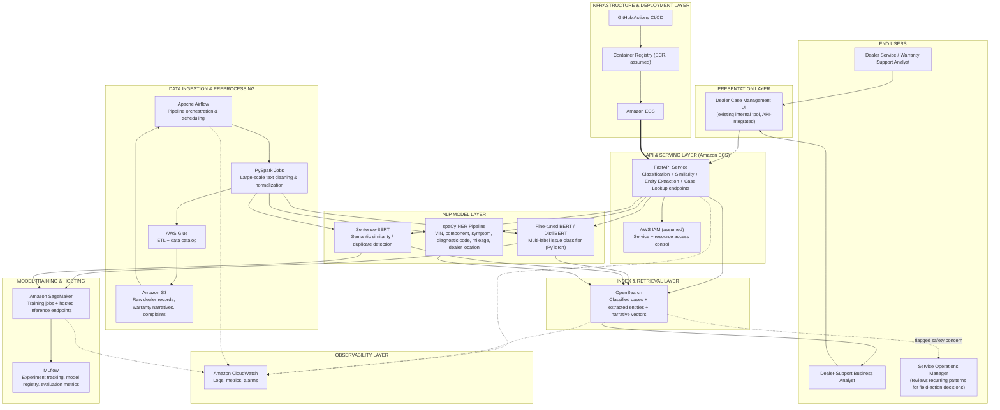
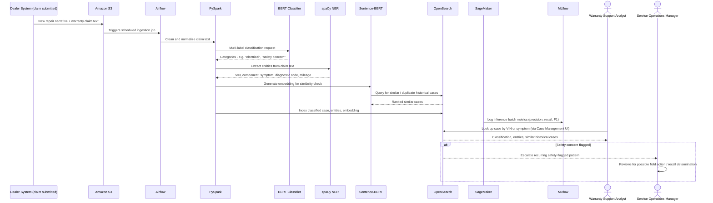

# Volvo Cars USA — BERT Dealer Service and Warranty Intelligence Platform — Architecture Deep Dive

**Prepared for:** Emeron Marcelle, Senior NLP & Machine Learning Engineer — interview / architecture-review prep
**Project:** BERT Dealer Service and Warranty Intelligence Platform, Volvo Cars USA, Mahwah, NJ (May 2020 – Jun 2022)
**Note on assumptions:** Your resume states the stack (Hugging Face Transformers, PyTorch, BERT/DistilBERT, Sentence-BERT, spaCy, PySpark, Airflow, S3, Glue, SageMaker, OpenSearch, FastAPI, MLflow, Docker, ECS) and the outcomes, but not every low-level design choice, exact team assignment, or delivery date. Anywhere below that goes past what's on the resume is a reasonable, defensible assumption for a system of this type — labeled so you can confirm, adjust, or replace it with what actually happened.

A structural note before diving in: this project is a different shape than the Novartis and NRG copilots. There's no LLM generating conversational answers here — this is a classical NLP pipeline (classification, entity extraction, semantic similarity) feeding a search/lookup tool that dealer-support analysts use directly. It's worth being able to speak to that distinction in an interview: not everything on your resume is a GenAI/RAG system, and this project demonstrates the classic ML/NLP foundation underneath your later GenAI work.

---

## 1. Architecture Diagram

### Runtime example — from a new warranty claim to an analyst's case lookup

---

## 2. Node-by-Node Breakdown

### 2.1 End Users

**Dealer Service / Warranty Support Analyst**
- *What it does:* The primary user — looks up a specific warranty claim or repair case, reviews its classification, extracted entities, and similar historical cases to speed up triage and root-cause investigation.
- *Who's in charge:* Volvo Cars USA dealer service/warranty operations (business stakeholder, not part of the build team).
- *Phase:* Engaged from Phase 0 (requirements/taxonomy definition) through pilot and continuously post-launch.

**Dealer-Support Business Analyst**
- *What it does:* Uses aggregated classification output to spot recurring issue patterns across the dealer network — not one claim at a time, but trends across hundreds of dealers.
- *Who's in charge:* Volvo Cars USA dealer-support operations.

**Service Operations Manager**
- *What it does:* Reviews recurring, especially safety-flagged, patterns the platform surfaces to decide whether a broader field action, technical service bulletin, or recall investigation is warranted.
- *Who's in charge:* Volvo Cars USA Service/Quality organization.
- *Why this role exists in the architecture at all:* This is the automotive-industry equivalent of the human-in-the-loop principle seen in the Novartis and NRG projects, calibrated to its own stakes — a misclassified "safety concern" complaint isn't just a data quality issue, it can delay a legally significant recall/reporting decision (see Section 3), so the design deliberately routes safety-flagged patterns to a human decision-maker rather than only surfacing them in a passive dashboard.
- *Phase:* Engaged from Phase 0, actively involved from Phase 7 (evaluation) onward.

### 2.2 Presentation Layer

**Dealer Case Management UI**
- *What it does:* The existing internal tool dealer-support analysts already used daily; this project integrated NLP-powered lookup into it via API rather than building a new front-end.
- *Who's in charge:* An existing internal tools/platform team at Volvo; your team's responsibility was the API contract it consumed, not the UI itself.
- *Why integrate into an existing tool over building a new one:* Analysts already lived in this system all day — adding classification, entity, and similarity data to their existing workflow avoided a costly change-management effort and got the capability in front of users faster than a parallel new application would have.
- *Phase:* Phase 6 (Model Serving & Integration), weeks 24–30.

### 2.3 API & Serving Layer

**FastAPI Service**
- *What it does:* Exposes the four capabilities described in your resume as REST endpoints — classification, similarity matching, entity extraction, and case lookup — so the Case Management UI (and potentially other internal tools) can consume model outputs in near real time.
- *Who's in charge:* You, as the engineer who deployed the model inference service.
- *Why FastAPI over alternatives (Flask, a SageMaker-hosted endpoint called directly from the UI):* FastAPI gave a single, well-documented internal API surface across all four capabilities, decoupling the Case Management UI from needing to know which capability was served by SageMaker directly versus OpenSearch versus a local model — one consistent contract instead of four different integration patterns.
- *Phase:* Phase 6, weeks 24–30.

**AWS IAM (assumed)**
- *What it does:* Controls which services and users can invoke the API and access underlying AWS resources (S3, SageMaker endpoints, OpenSearch).
- *Who's in charge:* Cloud/DevOps or MLOps engineers on the team.
- *Why this is a reasonable assumption:* Your resume's environment list for this project doesn't explicitly name IAM the way the Novartis and NRG bullets do, but any AWS-hosted service handling internal dealer/customer data would need baseline IAM-based access control — it's included here as a minimum-viable-security assumption, not a stated fact.
- *Phase:* Phase 2 (Core Infrastructure Setup), weeks 8–14.

### 2.4 NLP Model Layer

**Fine-tuned BERT / DistilBERT (multi-label classifier)**
- *What it does:* Classifies each service/warranty text into one or more categories — powertrain, infotainment, electrical, braking, software update, safety concern, parts delay, dealer escalation — handling cases that span more than one category at once.
- *Who's in charge:* You, hands-on, fine-tuning and evaluating the models.
- *Why BERT/DistilBERT over alternatives (a classic TF-IDF + logistic regression classifier, a larger generative LLM):* Warranty and complaint text is highly domain-specific and context-dependent (the same words can mean different things in an electrical versus infotainment complaint) — a transformer's contextual understanding meaningfully outperforms bag-of-words approaches here. A full generative LLM would have been unnecessary and slower/costlier for what is fundamentally a classification task, not a generation task — this is a good example of matching model complexity to the actual job instead of defaulting to the biggest available model.
- *Why multi-label instead of single-label classification:* Real complaints often describe overlapping issues (e.g., an infotainment failure that also caused unexpected battery drain) — forcing a single label per case would have thrown away information analysts needed and undercounted how often certain issue types actually co-occurred.
- *Phase:* Phase 3 (Model Development — Classification), weeks 10–20.

**Sentence-BERT**
- *What it does:* Produces sentence-level embeddings so new repair narratives can be compared directly, via cosine similarity, against the full history of prior cases to surface duplicates or closely related claims.
- *Who's in charge:* You.
- *Why Sentence-BERT over alternatives (comparing raw BERT [CLS] embeddings, a simpler TF-IDF cosine similarity):* Raw BERT wasn't designed to produce embeddings optimized for direct sentence-to-sentence comparison at scale — Sentence-BERT's siamese-network training objective specifically optimizes for that use case, which matters a lot when you're comparing a new case against potentially thousands of historical ones efficiently.
- *Phase:* Phase 4 (Semantic Similarity & Entity Extraction), weeks 16–24.

**spaCy NER Pipeline**
- *What it does:* Extracts structured entities from free-text narratives — vehicle model, component, symptom, diagnostic code, repair action, mileage, dealer location, and warranty-specific terms like VIN.
- *Who's in charge:* You.
- *Why spaCy over alternatives (a regex-based extraction approach, a custom fine-tuned transformer NER model):* spaCy's pipeline architecture made it straightforward to combine its built-in NER with custom, domain-specific entity patterns (VINs, diagnostic trouble codes) without needing to train an entire transformer model just for entity extraction — a lighter-weight tool matched to a well-scoped extraction task.
- *Phase:* Phase 4, weeks 16–24.

### 2.5 Model Training & Hosting

**Amazon SageMaker**
- *What it does:* Runs the training jobs for the BERT/DistilBERT classifier and Sentence-BERT model, and hosts the trained models as inference endpoints the FastAPI service calls.
- *Who's in charge:* You, with infrastructure support from MLOps/DevOps.
- *Why SageMaker over alternatives (self-managed EC2 GPU instances, a different managed ML platform):* SageMaker's managed training jobs and hosted endpoints removed the operational burden of provisioning and managing GPU infrastructure directly, and it was already the AWS-native choice consistent with the rest of the AWS-based stack (S3, Glue) used on this project.
- *Phase:* Phase 3–4, weeks 10–24.

**MLflow**
- *What it does:* Tracks every training run's metrics — precision, recall, F1-score, confusion matrix, class-level error patterns — and versions the models so a specific production model can always be traced back to the experiment and data that produced it.
- *Who's in charge:* You.
- *Why MLflow over alternatives (manually tracked spreadsheets, SageMaker Experiments alone):* A dedicated experiment tracker gave a consistent, queryable history across many training iterations of a multi-label classifier — necessary for systematically improving classification accuracy over time and for explaining *why* a particular model version was chosen if a misclassification issue ever needed root-causing.
- *Phase:* Phase 7 (Evaluation & Monitoring Setup), weeks 26–32, used continuously through every retraining cycle after that.

### 2.6 Data Ingestion & Preprocessing

**Apache Airflow**
- *What it does:* Orchestrates the recurring pipeline — pulling new dealer service records, triggering PySpark preprocessing, kicking off scoring/classification runs, and re-indexing results into OpenSearch on a schedule.
- *Who's in charge:* Data Engineers.
- *Why Airflow over alternatives (cron jobs, AWS Step Functions):* Airflow's DAG model made the dependencies between preprocessing, scoring, and indexing steps explicit and easy to monitor/retry individually, which matters when a pipeline has several stages that can each fail independently — a set of unconnected cron jobs would have made failures much harder to trace.
- *Phase:* Phase 1 (Data Pipeline & Labeling Strategy), weeks 5–12.

**PySpark**
- *What it does:* Cleans and normalizes large volumes of noisy service narratives at scale — removing boilerplate, normalizing abbreviations, and structuring raw dealer records into model-ready text.
- *Who's in charge:* Data Engineers, with labeling strategy defined by you and Dealer-Support Business Analysts.
- *Why PySpark over alternatives (single-machine Pandas preprocessing):* Dealer service records across Volvo's entire US dealer network is a genuinely large-scale text dataset — Pandas on a single machine would not scale to that volume in a reasonable processing window, whereas PySpark distributes the cleaning workload across a cluster.
- *Phase:* Phase 1, weeks 5–12.

**Amazon S3**
- *What it does:* Stores the raw dealer service records, warranty narratives, and complaint text before and after preprocessing.
- *Who's in charge:* Data Engineers.
- *Phase:* Phase 1, weeks 5–12.

**AWS Glue**
- *What it does:* Handles ETL jobs and data cataloging, making the S3-stored data queryable and discoverable in a structured way for downstream processing.
- *Who's in charge:* Data Engineers.
- *Why Glue over alternatives (custom ETL scripts with no catalog):* A managed catalog matters when many independently-operated dealers are the ultimate data source (see Section 3) — Glue's schema/catalog management helps handle the inevitable inconsistency in how different dealer systems export their data.
- *Phase:* Phase 1, weeks 5–12.

### 2.7 Index & Retrieval Layer

**OpenSearch**
- *What it does:* Indexes classified cases, extracted entities, and narrative vectors together, so an analyst's lookup (by VIN, by symptom, by component) returns classification, entity, and similar-case information from one query.
- *Who's in charge:* You and Data Engineers.
- *Why OpenSearch over alternatives (a plain relational database with full-text search, a dedicated vector-only database):* OpenSearch's ability to combine structured filtering (VIN, dealer location, date range), full-text keyword search, and vector similarity search in one engine matched exactly the mixed query pattern analysts needed — a plain SQL database would have handled the structured filtering well but not the semantic similarity matching central to duplicate-case detection.
- *Phase:* Phase 5 (Indexing & Search), weeks 20–26.

### 2.8 Infrastructure & Deployment Layer

**Amazon ECS**
- *What it does:* Hosts the containerized FastAPI service.
- *Who's in charge:* DevOps/MLOps engineers.
- *Phase:* Phase 2, weeks 8–14; used throughout every subsequent phase.

**Container Registry (assumed)**
- *What it does:* Stores the Docker images before deployment to ECS.
- *Who's in charge:* DevOps/MLOps engineers.
- *Phase:* Phase 2, weeks 8–14. *(Not explicitly named on your resume — the standard companion to an ECS-based deployment, included for completeness.)*

**GitHub Actions**
- *What it does:* Automates build, test, and deployment of the FastAPI service and, likely, the model training/evaluation pipeline code.
- *Who's in charge:* DevOps/MLOps engineers.
- *Phase:* Phase 2 (pipeline established), weeks 8–14; used continuously afterward.

### 2.9 Observability Layer

**Amazon CloudWatch**
- *What it does:* Collects logs and metrics from the FastAPI service, SageMaker endpoints, Airflow runs, and OpenSearch — latency, error rates, pipeline failures.
- *Who's in charge:* DevOps/MLOps engineers, with dashboards reviewed by you.
- *Phase:* Phase 2 (baseline), weeks 8–14; expanded through later phases.

---

## 3. Automotive/Warranty-Specific Details Woven Into the Architecture

Concepts specific to automotive warranty and dealer operations that shape this design, distinct from the pharma and energy-retail contexts of your other two projects:

**NHTSA and the TREAD Act.** Under the Transportation Recall Enhancement, Accountability, and Documentation (TREAD) Act, automakers are legally required to report certain safety-related warranty claims, field reports, and customer complaints to the National Highway Traffic Safety Administration (NHTSA) on a defined schedule. This is the direct reason "safety concern" exists as its own classification label rather than being folded into a generic "other" category — a misclassified safety complaint isn't just a data quality problem, it risks delaying a legally mandated report, which is why safety-flagged patterns are routed to the Service Operations Manager rather than only appearing in a passive analytics dashboard.

**Recall and field-action determination.** Recurring issue patterns the platform surfaces — the same component failing across many vehicles of the same model/year — feed into Volvo's internal process for deciding whether a technical service bulletin, extended warranty campaign, or full recall is warranted. Getting duplicate/related-case detection wrong here (missing that many "unrelated" complaints are actually the same underlying defect) has real safety and liability consequences, not just an inconvenience for an analyst.

**State Lemon Laws.** Most US states have "lemon laws" requiring a manufacturer to buy back or replace a vehicle after a defined number of unsuccessful repair attempts for the same problem on the same vehicle. This is a specific, concrete reason VIN extraction and case-linking (via spaCy NER and Sentence-BERT similarity) matter beyond convenience — failing to link repeated repair attempts on a single VIN back to each other could cause a manufacturer to miss a legally triggered buyback obligation.

**Independent dealer network data quality.** Unlike a single company's internal systems, Volvo's data here originates from a large network of independently operated, franchised dealers with varying documentation habits, system quality, and terminology. This is the practical, day-to-day reason the PySpark preprocessing stage (normalizing abbreviations, removing boilerplate, structuring inconsistent free text) is as significant a piece of the architecture as the modeling itself — the data quality problem here is structurally different from a single-company, single-system environment like the Novartis or NRG projects.

**Customer PII in complaint text.** Customer complaint narratives can include names, contact details, and other personal information alongside the technical content. Even though this project predates the heavier LLM-governance conversation, standard data handling practice would still call for access control (IAM) and careful scoping of what's indexed and exposed through the Case Management UI — worth acknowledging even though it isn't the headline concern the way GxP or billing-disclosure compliance is for the other two projects.

---

## 4. Delivery Timeline Summary

| Phase | Focus | Primary Owner(s) | Approx. Duration |
|---|---|---|---|
| 0 — Discovery & Requirements | Define issue taxonomy and priorities with dealer-support stakeholders | Dealer-Support Business Analysts, you | Weeks 1–4 |
| 1 — Data Pipeline & Labeling Strategy | Airflow orchestration, PySpark preprocessing, S3/Glue setup, multi-label taxonomy definition | Data Engineers, you | Weeks 5–12 |
| 2 — Core AWS Infrastructure Setup | IAM, ECS, container registry, CI/CD, CloudWatch baseline | DevOps/MLOps Engineers | Weeks 8–14 (overlaps Phase 1) |
| 3 — Model Development: Classification | Fine-tune BERT/DistilBERT, implement multi-label logic in PyTorch | You | Weeks 10–20 |
| 4 — Semantic Similarity & Entity Extraction | Sentence-BERT similarity workflows, spaCy NER pipeline | You | Weeks 16–24 |
| 5 — Indexing & Search | Index classified cases, entities, and vectors in OpenSearch | You, Data Engineers | Weeks 20–26 |
| 6 — Model Serving & Integration | FastAPI endpoints, integration into existing Case Management UI | You | Weeks 24–30 |
| 7 — Evaluation & Monitoring Setup | MLflow tracking, precision/recall/F1, confusion matrix, misclassification analysis | You | Weeks 26–32 |
| 8 — Pilot / UAT with Dealer-Support Analysts | Real analysts test real historical cases in a controlled rollout | Dealer-Support Business Analysts, QA/Testing | Weeks 30–36 |
| 9 — Production Rollout & Hypercare | Rollout, elevated monitoring, fast-response support | Full team | Weeks 36–40 |
| 10 — Continuous Monitoring & Retraining | Ongoing model retraining as new categories/patterns emerge | You, full team | Month ~9 – Jun 2022 (end of engagement) |

Total time to initial production go-live: **roughly 8–9 months**, with continuous monitoring and retraining for the remainder of the engagement — consistent with a role that ran from May 2020 to June 2022.

---

## 5. How to Use This Document

As with the other two architecture documents, everything past what your resume states directly — team assignments, phase durations, the assumed IAM/container-registry detail, and the specific trade-off reasoning — is a well-reasoned assumption built to be consistent with the stack and outcomes described, not a transcript of what actually happened at Volvo. Decide which parts match your real experience closely enough to state as fact in an interview, and which you'd want to soften or replace with what you actually remember.
