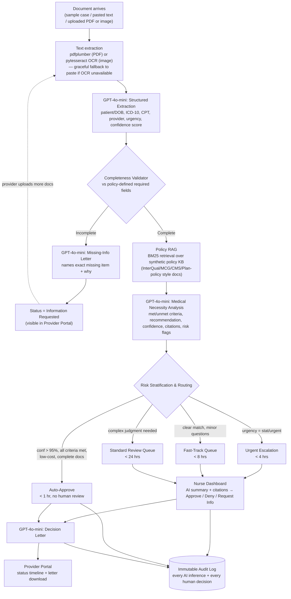

# Prior Authorization AI — Streamlit Demo

## Context

`Prior_Auth_AI_Solution.pdf` is a consulting proposal: an AI architecture to cut prior-auth
turnaround from 4.2 days to 2.5 days for a regional health plan, via four layers (Intake →
Intelligence/RAG → Decision Support/Routing → Communication) and human-in-the-loop governance.
The goal now is a working **Streamlit demo** that makes this concrete and clickable — something
to walk a CMO or interviewer through end-to-end — using the user's OpenAI **gpt-4o-mini** key for
every AI step. This is a greenfield build (the folder currently contains only the PDF), so the
plan below is the full implementation design, not a change to existing code.

Confirmed decisions (from clarifying questions):
- **Intake**: sample cases + free-text paste, **plus** real file upload (PDF/image) with
  lightweight OCR — implemented so it degrades gracefully if the OCR binary isn't installed.
- **Deployment**: local-only (`streamlit run app.py`), secrets via a local `.env` file.
- **Policy knowledge base**: synthetic, clearly-fictional policy criteria (~6 docs) written for
  this demo — no real payer IP or PHI.
- **API key**: `.env.example` → user copies to `.env` and pastes their real key there (outside
  chat), loaded via `python-dotenv`.

## Workflow Diagram (for confirmation)



This mirrors the PDF's 4-layer architecture (Intake / Intelligence / Decision Support /
Communication) and its governance requirement that **AI recommends, humans decide** except for
pre-approved low-risk auto-approvals.

## App Structure (Streamlit multipage)

```
prior_auth_demo/
  app.py                        # Home: problem recap + architecture overview (PDF pages 1-3 as UI)
  pages/
    1_New_Request.py            # Intake -> extraction -> completeness -> RAG -> routing (live trace)
    2_Nurse_Dashboard.py         # Queue + AI summary + Approve/Deny/Request-Info (human-in-the-loop)
    3_Provider_Portal.py         # Status lookup, missing-doc checklist, decision letter download
    4_Analytics_Audit.py         # Projected outcomes chart + live session metrics + audit log
  core/
    config.py                   # .env loading, OpenAI client
    schemas.py                  # Pydantic models (ExtractedRequest, PolicyAnalysis, RiskRouting…)
    ocr.py                      # pdfplumber for PDF text; pytesseract for images; safe fallback
    extraction.py                # GPT-4o-mini structured extraction (structured outputs/JSON)
    completeness.py              # rule-based check vs per-CPT required fields
    policy_rag.py                 # rank_bm25 retrieval over policy_kb + GPT-4o-mini analysis
    routing.py                    # risk stratification -> pathway (per PDF's SLA table)
    letters.py                    # GPT-4o-mini missing-info & decision letter generation
    store.py                      # SQLite persistence: requests, audit_log
  data/
    policy_kb/                   # ~6 synthetic policy snippets (JSON: id, title, source, cpt_codes, criteria[])
    sample_requests/             # ~5 synthetic PA request texts covering each demo scenario
    demo.db                      # created at runtime (gitignored)
  .env.example                   # OPENAI_API_KEY=your-key-here
  requirements.txt
  README.md                      # setup incl. optional Tesseract install note for image OCR
```

## Key Implementation Notes

- **Structured LLM calls**: use OpenAI's structured outputs (`client.beta.chat.completions.parse`
  with Pydantic models) on `gpt-4o-mini` for extraction and policy analysis, so outputs are
  type-safe JSON (no manual parsing/regex).
- **OCR**: PDFs go through `pdfplumber` (pure Python, no external binary — handles the common
  "digitally generated PDF" case, including re-processing this proposal's own PDF as a fun
  sanity check). Images go through `pytesseract`; if the Tesseract binary isn't found, show a
  clear Streamlit warning with a Windows install link and let the user fall back to paste/sample.
- **Policy RAG**: `rank_bm25` over the synthetic `policy_kb` (keyword/BM25 retrieval — labeled in
  the UI as "simplified for demo; production uses hybrid BM25+semantic search with a
  cross-encoder reranker over InterQual/MCG/CMS/plan policies," per the PDF). Top passages are
  passed to GPT-4o-mini for the structured medical-necessity analysis with citations.
- **Routing logic** (`routing.py`) implements the PDF's exact pathway table: Auto-Approve
  (confidence > 95%, all criteria met, low-cost, complete), Urgent/STAT (urgency flag, < 4h),
  Fast-Track (clear match + minor questions, < 8h), Standard Review (complex, < 24h).
- **Human-in-the-loop**: only Auto-Approve pathway skips the nurse; every other path requires an
  explicit Approve/Deny/Request-Info action on the Nurse Dashboard, captured with a reviewer name
  and timestamp — enforced in `store.py`, not just the UI, so it matches the PDF's governance
  claim.
- **Audit trail**: every AI inference (component, model, input summary, output, confidence,
  timestamp) and every human decision is written to the `audit_log` SQLite table and viewable/
  exportable (CSV) on the Analytics & Audit page — demonstrating the PDF's "Complete Audit Trail"
  governance control.
- **Synthetic data only**: all sample PA requests, patient details, and policy snippets are
  clearly fictional (fake names/IDs), created for this demo — no real PHI or proprietary payer
  policy text.
- **Charts**: the Analytics page will use the `dataviz` skill when built, for the projected
  outcomes chart (PDF's turnaround/rework/auto-approve/nurse-capacity table across phases) and
  the live session metrics chart.
- **Secrets**: `.env.example` committed with a placeholder; `.env` (real key) and `demo.db` are
  gitignored. `core/config.py` fails with a friendly Streamlit error (not a stack trace) if
  `OPENAI_API_KEY` is missing.

## Verification

1. `pip install -r requirements.txt` then `streamlit run app.py` — app launches without errors
   with a placeholder-free `.env`.
2. Walk all 5 sample cases through **New Request**: confirm each produces the expected pathway
   (one auto-approve, one missing-info/rework, one fast-track, one standard, one urgent) and that
   the live pipeline trace shows every step.
3. On **Nurse Dashboard**, confirm queued (non-auto-approve) cases appear, AI summary/citations
   render, and Approve/Deny/Request-Info writes a decision + generates a letter.
4. On **Provider Portal**, look up a request by ID and confirm status/timeline/letter download
   match what happened in steps 2-3.
5. On **Analytics & Audit**, confirm the audit log lists every AI call and human decision made
   during the walkthrough, and is exportable as CSV.
6. Upload a real PDF (e.g. the proposal PDF itself) and a real image to confirm OCR path works or
   fails gracefully with a clear message.
