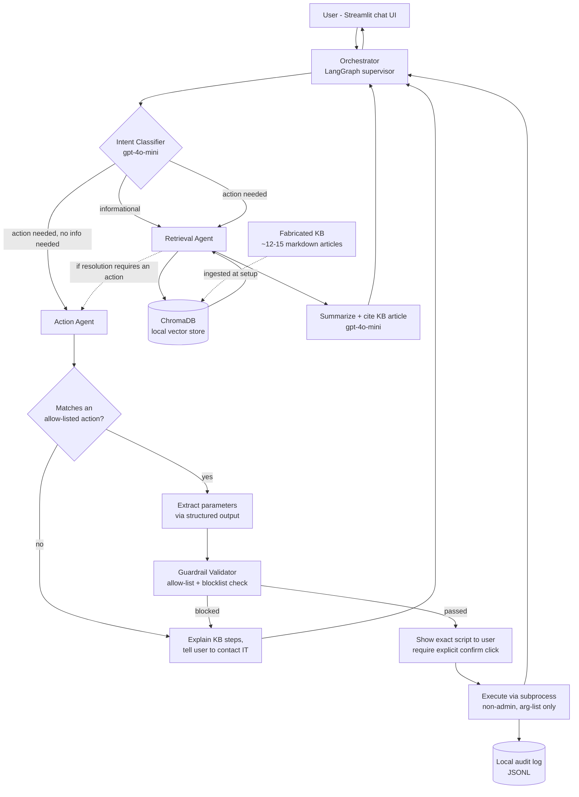

# Multi-Agent RAG IT Support SLM — Design Draft

**Scope:** Sample/demo project, 3-day build. Fabricated internal IT knowledge base. Real local script execution, restricted to a small allow-list of safe, non-admin actions.

## 1. Core design principle

The riskiest part of this system is "agent writes and runs a script." Rather than letting the LLM generate arbitrary code and then trying to sandbox or filter it after the fact, the Action Agent never writes free-form scripts. It only does two things: classify which of a small, pre-approved set of actions the user needs, and extract the parameters for that action (a drive letter, a UNC path, a printer name, an app name). The actual script is a static, hand-audited template with parameters substituted safely via argument lists, never string-concatenated shell commands. This turns "can the agent be tricked into running something dangerous" into a much smaller problem — there are only 4 templates, and none of them touch anything requiring elevation. This is the main simplification that keeps the architecture buildable in 3 days.

## 2. Architecture diagram

## 3. Component breakdown and recommended tools

| Phase | Recommended tool | Why it fits a 3-day build |
|---|---|---|
| Orchestration / multi-agent routing | LangGraph, supervisor pattern (1 router + 2 worker agents) | Minimal boilerplate for routing between a retrieval agent and an action agent; avoids building your own state machine |
| LLM | OpenAI `gpt-4o-mini` for classification, summarization, and parameter extraction | Fast and cheap enough to call multiple times per turn; upgrade to `gpt-4o` only if answer quality on demo day needs it |
| Embeddings | OpenAI `text-embedding-3-small` | Cheap, good enough for a 15-document corpus |
| Vector store | ChromaDB, local persistent mode | Zero infrastructure — no server to stand up, runs from a Python process, fine for a fabricated 15-article KB |
| Knowledge base format | Markdown files with YAML frontmatter (`title`, `category`, `tags`) | Easy to fabricate quickly, easy to chunk, easy to cite back to the user |
| UI | Streamlit chat app | Fastest way to get a working chat + "confirm before running" button interaction |
| Action parameter extraction | OpenAI function calling / structured output (Pydantic schema per template) | Forces the LLM's output into a fixed shape instead of freeform text, which is what makes the guardrail simple |
| Script templates | 4 static PowerShell templates (see §5), rendered with Python f-strings/Jinja2 | No codegen risk — the LLM never writes the script body, only fills typed fields |
| Execution | `subprocess.run([...])` with an argument list, never `shell=True` | Avoids shell injection entirely; runs as the logged-in user, no elevation |
| Guardrail validator | Keyword blocklist + strict allow-list of the 4 template IDs | Second layer of defense in case parameter extraction produces something unexpected |
| Audit logging | Append-only local `audit_log.jsonl` (timestamp, user, action, params, output, success/fail) | Simple, demonstrable "we log every action taken" story for the write-up |

## 4. Flow walkthrough

1. User asks a question in the Streamlit chat.
2. The Orchestrator's classifier node tags the turn as informational, action-needed, or both.
3. For informational turns, the Retrieval Agent embeds the query, pulls the top-k chunks from ChromaDB, and asks `gpt-4o-mini` to summarize the answer with a citation back to the source KB article title.
4. If the retrieved article implies a fixable action (e.g., "Fix: map the shared drive using the steps below"), the Action Agent checks whether that action matches one of the 4 allow-listed templates.
5. If it matches, the agent uses structured output to extract the needed parameters from the user's message and the KB article (e.g., drive letter, UNC path). If a required parameter is missing, it asks the user a follow-up question instead of guessing.
6. The filled-in script is passed through the Guardrail Validator, which checks it against the blocklist and confirms it's one of the 4 approved template IDs and nothing else.
7. The exact script text and a plain-English description are shown to the user in the UI. Execution only happens after the user clicks an explicit "Run" confirmation — this human-in-the-loop step is not optional.
8. The script runs locally via `subprocess.run` with an argument list, output is captured, and the result (success/failure + output) is shown to the user and appended to the audit log.
9. If the action doesn't match any allow-listed template, or the KB article indicates the fix requires admin rights, the agent gives the user the KB steps and tells them to contact IT rather than attempting anything.

## 5. Allow-listed actions (the only 4 scripts the Action Agent can ever run)

| Action | Template (Windows/PowerShell) | Required parameters |
|---|---|---|
| Map a network/shared drive | `New-PSDrive -Name X -PSProvider FileSystem -Root "\\server\share" -Persist` | drive letter, UNC path |
| Install a printer driver | `Add-PrinterDriver -Name "<driver>"` (from a pre-approved local driver store, no downloads) | driver name |
| Map a network printer | `Add-Printer -ConnectionName "\\printserver\printername"` | print server, printer name |
| Install an approved app | `winget install --id <approved-app-id> --silent` (id restricted to a pre-approved app list) | app id (validated against allow-list, not free text) |

None of these require `-Verb RunAs`, admin group membership, or registry/user-account changes. Anything outside this list (installing unapproved software, editing the registry, creating users, changing execution policy, deleting files, disabling security features) is explicitly out of scope and the agent declines and defers to human IT staff.

Guardrail blocklist (reject immediately if any of these appear anywhere in a proposed action, even though the LLM should never produce them): `Start-Process -Verb RunAs`, `sudo`, `Set-ExecutionPolicy`, `New-LocalUser`, `Remove-Item -Recurse -Force`, `reg delete`, `reg add`, `net user /add`, `diskpart`, `format`, `icacls`, `Disable-*` (any Defender/Firewall cmdlet).

## 6. Fabricated knowledge base

Since this is a sample project, the KB is a folder of ~12–15 markdown articles you write by hand (or generate once with an LLM and lightly edit), covering a realistic IT-helpdesk spread, for example: VPN connection issues, mapping a shared drive, installing a printer driver, connecting to a network printer, installing approved software via the app catalog, password reset policy, Wi-Fi connection troubleshooting, email client setup, two-factor authentication enrollment, disk space cleanup, VPN split-tunneling policy, and requesting admin access (this one should exist specifically so the agent can demonstrate declining to act and pointing to a human process). Each article gets a short frontmatter block (title, category, last-updated date, tags) so retrieval can cite "Source: Mapping a Shared Drive, updated 2026-06-02."

## 7. Three-day build plan

| Day | Focus |
|---|---|
| Day 1 | Write the 12–15 fabricated KB articles. Stand up ChromaDB, chunk + embed the KB. Build and test the Retrieval Agent in isolation (query in, cited summary out). |
| Day 2 | Build the LangGraph orchestrator (classifier + supervisor routing). Build the Action Agent: the 4 script templates, structured-output parameter extraction, and the guardrail validator. Wire up the Streamlit UI with the confirm-before-run step. |
| Day 3 | Integration testing end-to-end (informational-only, action-only, and mixed queries). Add audit logging. Test guardrail rejection paths (ask for something out of scope, confirm it declines correctly). Polish UI, prepare a short demo script with 4–5 sample queries, write up the README. |

## 8. Explicitly out of scope for this 3-day version

Multi-turn memory across sessions, support for non-Windows targets, a real ticketing-system integration, dynamic/user-editable action templates, and any script that touches user accounts, security settings, or requires elevation. These are reasonable "next steps" to mention in a demo but would blow the timeline if attempted now.
